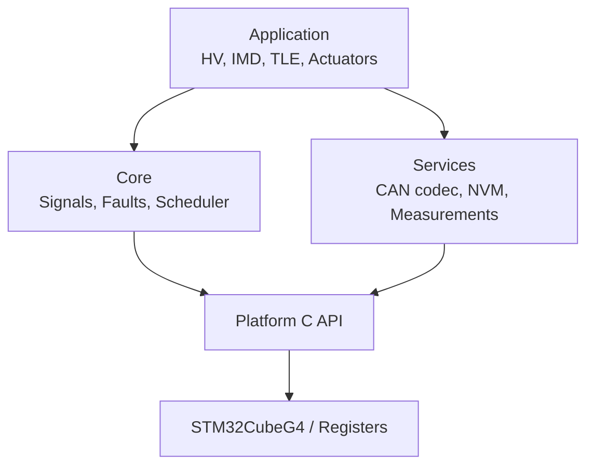
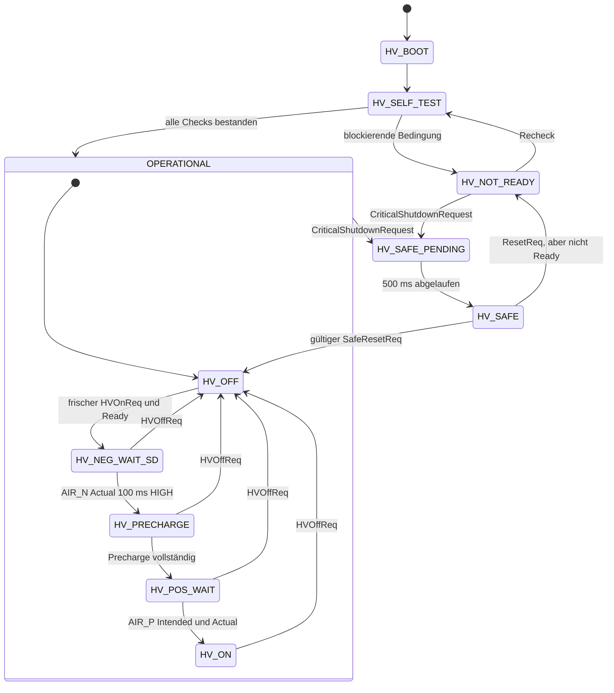
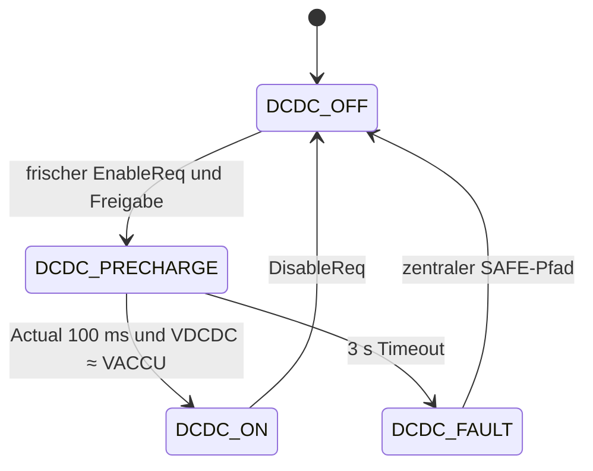
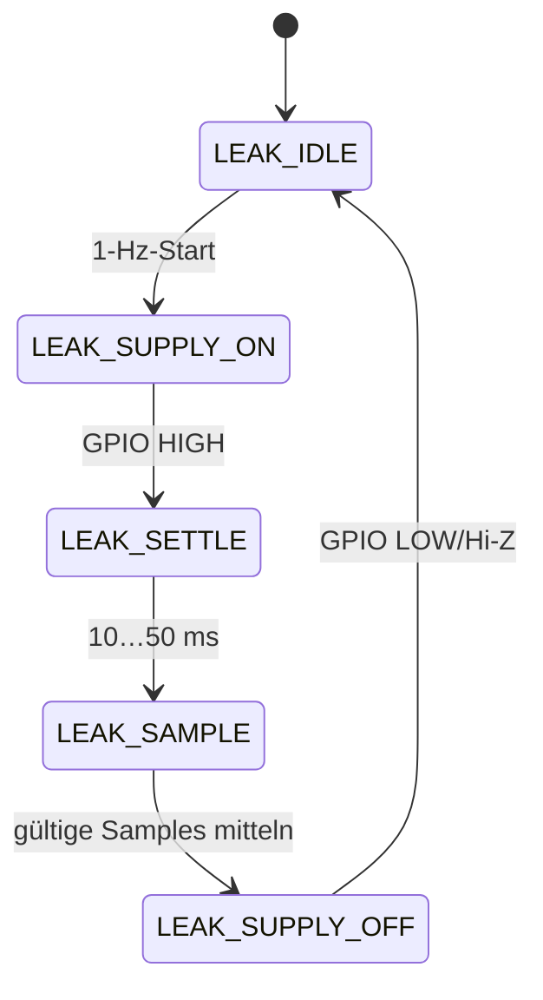
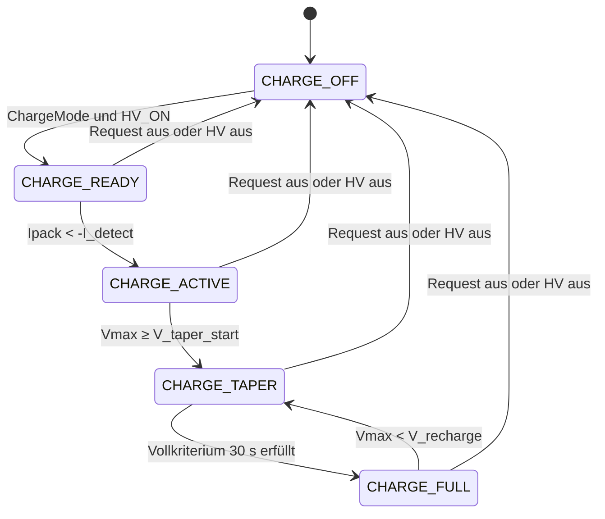
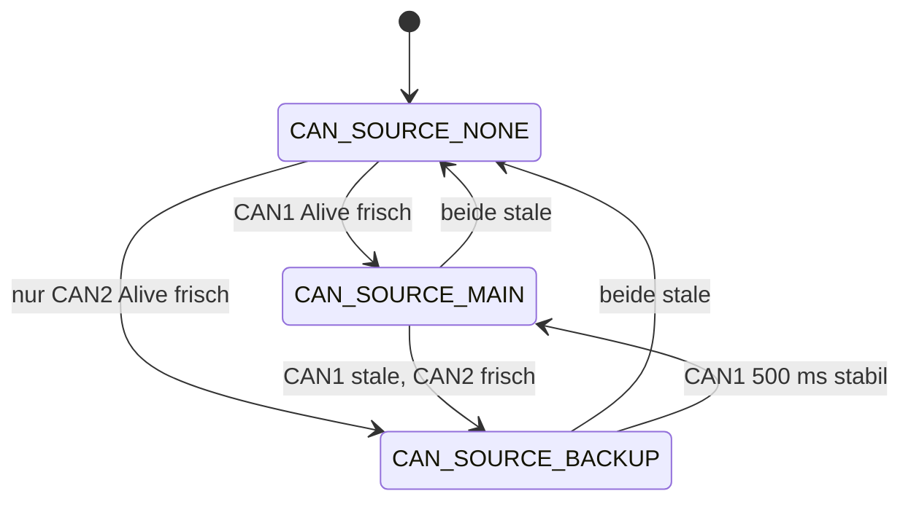

# BMS Master – Softwarearchitektur

**Version:** 0.12 (Codex-Übergabestand)  
**MCU:** STM32G483VET6, 16 MHz HSE  
**Sprachen:** Assembly, C11, C++17  
**Toolchain:** GNU Arm Embedded, CMake/Ninja  
**Ausführung:** deterministischer Superloop, kein RTOS  
**Ziel:** direkte Grundlage für Implementierung und Tests

## 1. Architekturentscheidungen

| Thema | Festlegung |
|---|---|
| Anwendungslogik | Testbare C++-Module ohne HAL-Abhängigkeit |
| Treiber/ISR/BSP | C, STM32CubeG4 HAL/LL nur innerhalb der Plattformschicht |
| Assembly | Startup sowie minimaler HardFault-Veneer zur Registerübergabe |
| Toolchain | `arm-none-eabi-gcc/g++/as`; CMake + Ninja; keine IAR-Abhängigkeit |
| Dynamik | Kein Heap nach Startup, keine Exceptions, kein RTTI |
| Zeit | Eine monotone Zeitbasis; alle Stateflows und Timeouts nichtblockierend |
| Sicherheit | Ein zentraler Fault Manager erzeugt `CriticalErrorActive`; im Produktionsbetrieb ist `CriticalShutdownRequest` identisch und der einzige HV-Fehlerpfad |
| CAN | `CriticalErrorActive` wird auf CAN publiziert; lokal wird daraus ohne Self-RX der `CriticalShutdownRequest` gebildet |
| Abschaltung | Kontrollierte Fehler: 500 ms `SAFE_PENDING`; CPU-/Scheduler-Ausfall: externer Watchdog öffnet den SC über den Hardware-Latch |
| SAFE-Rearm | Separater CAN-Reset nur nach Fehlerfreiheit; ein gesetzter `SC_Latched` ist per CAN nicht löschbar und erfordert Power-Cycle |
| Ausgänge | HV-/DCDC-Stateflow oder der explizite Developer-Owner erzeugen Sollwerte; ein Output Arbiter besitzt den einzigen GPIO-Commit |
| Daten | Signal Store mit Wert, Zeitstempel, Gültigkeit und Qualität; keine verteilten globalen Variablen |
| Tests | Domain-Module laufen unverändert als Host-Tests; Hardwarezugriffe werden über kleine C-Interfaces ersetzt |
| Bring-up | Compile-Time-Profil mit `kTleSlaveCount = 1` und volatilem Developer-Modus; Produktion nutzt 18 Slaves und enthält keine aktivierbare Developer-Ausgangsfreigabe |

Pinbelegung, Alternate Functions, GPIO-Defaults, Clock, Timer, ADC, DMA und NVIC sind ausschließlich in [`ioc_resource_assignment.md`](ioc_resource_assignment.md) definiert und werden hier nicht dupliziert.

Jeder Mess-/Kommunikationswert trägt einen Zeitstempel und dieselbe Qualitätscodierung:

| Wert | `SignalQuality` | Bedeutung |
|---:|---|---|
| 0 | `SIGNAL_INVALID` | noch kein verwertbarer Wert |
| 1 | `SIGNAL_VALID` | aktuell und plausibel |
| 2 | `SIGNAL_STALE` | Zeitlimit überschritten |
| 3 | `SIGNAL_FAULT` | Transport-, Bereichs- oder Plausibilitätsfehler |

### Sprachaufteilung

- **Assembly:** Auswahl MSP/PSP im HardFault, Übergabe des Stackframes an C. Keine Fachlogik.
- **C:** Clock/GPIO/DMA/ADC/FDCAN/UART/I²C/Timer, ISR, Ringbuffer, Board Support.
- **C++:** Scheduler, Signal Store, Fault Manager, HV-Stateflow, Plausibilisierung, Filter, IMD-Auswertung, Leakage-Sequencer, TLE-Ablauflogik, Buzzer-Sequencer.

## 2. Softwarezuschnitt

| Modul | Sprache | Verantwortung |
|---|---|---|
| `startup/fault_entry` | ASM/C | Reset, HardFault-Stackframe, Resetursache |
| `platform/bsp` | C | Clock, sichere GPIO-Defaults, JTAG-Reservierung |
| `platform/timebase` | C | 1-MHz-Monotonic-Timer und Zeitstempel |
| `platform/adc_dma` | C | fünf ADC-Gruppen, Timertrigger, DMA-Ringbuffer |
| `platform/fdcan` | C | FDCAN1/2, Filter, feste RX/TX-Ringe, Bus-Off |
| `platform/uart_dma` | C | USART1/2 für TLE9015 |
| `platform/i2c_eeprom` | C | I²C2, WP, asynchrone Page-Transfers |
| `platform/capture` | C | Timer-Input-Capture für IMD-PWM |
| `core/scheduler` | C++ | absolute Releases, Laufzeit-/Deadline-Metriken |
| `core/signals` | C++ | typed Signal Store, Gültigkeit, Timeout |
| `core/faults` | C++ | Debounce, Latch, Severity, Fehleraggregation |
| `app/hv_state` | C++ | einziger Schütz-Stateflow |
| `app/output_arbiter` | C++ | Sollwertprüfung und finaler GPIO-Commit |
| `app/measurements` | C++ | Filter, Skalierung, NTC-LUT, Plausibilisierung |
| `app/leakage` | C++ | gepulste 1-Hz-Messsequenz |
| `app/imd` | C++ | Frequenz/Duty/RF-Auswertung und Timeout |
| `app/tle` | C++/C | Ring-/Linien-Protokoll, Slavescan, Temperaturen, Balancing |
| `app/can_app` | C++ | DBC-Codecs, RX-Requests, zyklische TX-Signale |
| `app/dcdc_state` | C++ | DCDC-Enable, Feedback und Spannungsangleichung |
| `app/power_limits` | C++ | Zellprofil, Temperatur-/SOC-Interpolation, Pack-Leistungsfreigabe |
| `app/charge_state` | C++ | Ladefreigabe, Spannungstaper, Ladeende und SOC-Anker |
| `app/soc_soh` | C++ | Energieintegration, Voll-Lade-Anker, Energie-/Widerstands-SOH und Checkpoints |
| `app/actuators` | C++ | Fan- und Buzzer-Sequencer |
| `app/nvm` | C++ | generische EEPROM-Records, CRC und Selbsttest |

Abhängigkeiten zeigen nur nach unten:



## 3. Ausführungsmodell

### Interrupts

ISR bleiben kurz und führen keine Fachlogik aus:

- ADC-DMA Half/Complete: fertigen Buffer markieren, Sequenzzähler erhöhen.
- FDCAN RX: Hardware-FIFO vollständig in festen Software-Ring leeren.
- FDCAN TX: nächsten Frame aus dem Ring anstoßen.
- USART DMA/IDLE: Transaktion abschließen und Status setzen.
- IMD Input Capture: High-/Low-/Periodenticks erfassen.
- PVD/Brownout: nur Diagnoseflag/Resetursache; kein EEPROM-Write.

### Scheduler

Der Scheduler arbeitet mit absoluten Release-Zeitpunkten. Die Fälligkeit aller
Tasks eines Dispatch-Durchlaufs wird gegen denselben Zeit-Snapshot geprüft;
damit kann eine langsamere Task nicht erst während der Prioritätsprüfung fällig
werden und eine synchron fällige schnellere Task überholen:

```cpp
if (time_due(now, task.next_release)) {
    task.next_release += task.period;
    run_task(task);
}
```

Bei verpassten Releases wird nicht unkontrolliert nachgeholt: einmal ausführen, weitere verpasste Perioden zählen und `next_release` vorsetzen. Damit entstehen weder Drift noch eine Catch-up-Spirale. Sind mehrere Tasks gleichzeitig fällig, werden sie stabil nach aufsteigender Periode ausgeführt; damit läuft beispielsweise die 1-ms-Task vor der 10-ms-Task. Tasks mit gleicher Periode behalten ihre Registrierungsreihenfolge.

| Periode | Inhalt |
|---:|---|
| jede Iteration | fällige Tasks in Prioritätsreihenfolge, Idle-Metrik |
| 1 ms | digitale Eingänge snapshotten; CAN RX dekodieren; Fast Fault Monitor; HV-/DCDC-Stateflow; Output Arbiter |
| 10 ms | ADC-Frames verarbeiten; 10er-Blockmittel publizieren; Packenergie integrieren; TLE-Service; Buzzer-Sequencer; schnelle CAN-TX |
| 20 ms | neuen TLE-Zellspannungszyklus starten/abschließen; Power-Limits, Charge-Stateflow und 15-s-Integral; Zielrate 50 Hz |
| 100 ms | WDBeat nach Health-Gate toggeln; Status-CAN; Fan-Request; SOC/SOH-Ausgabe; langsame Diagnose |
| 100 ms | nächsten TLE-TMPMUX-Schritt ausführen; 1-s-Temperaturmittel fortschreiben; kompletter 4-Phasen-Scan inkl. Referenzen in 400 ms |
| 1000 ms | `Heartbeat` toggeln; Leakage-Zyklus starten; Scheduler-Metriken publizieren |

Der Leakage-Sequencer wird trotz 1-Hz-Start in der 1-ms-/10-ms-Task fortgeschaltet, damit die 10…50-ms-Wartezeit nicht blockiert.

### Metriken pro Task

- letzte und maximale Laufzeit im 1-s-Berichtsfenster
- maximale Startlatenz
- Deadline Misses
- übersprungene Releases
- Run Counter
- Stack-/Loop-Health, soweit messbar

Der externe Watchdog wird nur getoggelt, wenn alle als kritisch markierten Tasks laufen und keine der nachfolgend definierten Health-Gate-Grenzen verletzt ist. `WDBeat` wird softwareseitig alle 100 ms umgeschaltet; ausdrücklich kein Hardware-PWM. Stoppt Scheduler oder Health-Gate, öffnet der externe Watchdog über den fest verdrahteten Hardware-Error-Latch den Shutdown Circuit. Dieser Pfad benötigt und erhält keine softwareseitige 500-ms-Verzögerung.

Kritisch sind die 1-, 10- und 20-ms-Tasks. Das Health-Gate fordert je Task `now − last_complete ≤ period + 1 ms` und keinen übersprungenen Release. Ein einzelner Deadline-/Laufzeit-Overrun setzt ID 4, darf aber noch genau einmal auftreten. Schließt der nächste Lauf derselben Task wieder innerhalb seiner Deadline ab, wird dieser Strike zurückgesetzt. Zwei direkt aufeinanderfolgende Overruns derselben kritischen Task setzen ID 3 und sperren weitere WDBeat-Flanken bis zum Reset. Ein übersprungener Release oder eine veraltete Taskcompletion sperrt das Gate weiterhin unmittelbar; Diagnose- und 1000-ms-Tasks beeinflussen den Watchdog nicht.

> Ein Toggle alle 100 ms erzeugt 10 Flanken/s, aber ein 5-Hz-Rechtecksignal. Gleiches gilt für die Heartbeat-LED: Toggle im 1-Hz-Task ergibt eine vollständige Blinkperiode von 2 s.

## 4. Boot und Initialisierung

1. Resetursache sichern; Schütz- und DCDC-Ausgänge sofort LOW, `LatchSC` LOW, Buzzer aus, EEPROM-WP HIGH.
2. HSE 16 MHz auf `SYSCLK = 160 MHz` und `FDCAN_KER = 80 MHz` konfigurieren; Clock Failure ist ein STM-HardFault.
3. JTAG-Ressourcen reservieren.
4. Monotonic Timer, GPIO-Eingänge, DMA, ADC, Capture, FDCAN, USART und I²C initialisieren.
5. Alle ADCs kalibrieren und VREFINT erfassen.
6. EEPROM-Grundfunktion prüfen, jüngsten gültigen `SystemConfig`- und `SocSohCheckpoint`-Record mit Schema/CRC laden und Topologie/Zellprofil gegen 162S2P prüfen. P50B/162S2P besitzt sichere Compile-Time-Defaults; ein fehlender IMD-Typ bleibt dagegen `IMD_TYPE_UNSET` und blockiert HV-/DCDC-Ready bis zur Provisionierung. Ein fehlender SOC-Record aktiviert `SOC_FALLBACK_LOW`.
7. Nichtblockierende Self-Tests starten:
   - `nPOR_State == HIGH`
   - `SC_Latched == LOW`
   - Schützrückmeldungen im offenen Zustand plausibel
   - TLE9015 und genau `kTleSlaveCount` TLE9012 antworten; Ring sowie beide Einzelpfade diagnostizieren
   - ADC-/VREF-Daten laufen
   - CAN-Controller gestartet
8. 500-ms-Hello-Beep als Sequenz starten.
9. IMD darf seine Startmessung im Hintergrund abschließen. Bis zur gültigen Freigabe bleibt `HVNotReady` aktiv.
10. Nur bei bestandenen blockierenden Checks nach `HV_OFF` wechseln. Der schreibende EEPROM-Selbsttest läuft niemals automatisch beim Boot.

### Developer-Modus

Der Developer-Modus existiert ausschließlich im Compile-Time-Profil `BOARD_BRINGUP`, ist nach jedem Reset aus und kann nicht im EEPROM aktiviert werden. Eintritt und Keepalive erfolgen über gültige `BMS_ServiceRequest`-Frames; `DEV_MODE_ENTER` enthält in `ServiceValue1` den festen Build-Key `BRT`, numerisch `0x00425254` (`B=0x42`, `R=0x52`, `T=0x54`), gegen versehentliche Aktivierung und muss spätestens alle 500 ms erneuert werden. Der Key ist kein Security-Mechanismus.

| Wert | `DeveloperMode` | Funktion |
|---:|---|---|
| 0 | `DEV_DISABLED` | normaler Produktionspfad |
| 1 | `DEV_OUTPUT_TEST` | AIR_N, Precharge, AIR_P und DCDC einzeln über `DeveloperOutputMask` schalten |
| 2 | `DEV_COMMISSIONING` | normaler HV-/DCDC-Stateflow mit fest definierter Readiness-Ausnahmeliste |

`DeveloperOutputMask`: Bit 0 `AIR_N`, Bit 1 `PCHRG`, Bit 2 `AIR_P`, Bit 3 `DCDC`. In `DEV_OUTPUT_TEST` darf die Maske die normale Schützreihenfolge bewusst umgehen, damit Ausgänge, Intended- und Actual-Pfade einzeln geprüft werden können. Das ist nur zulässig, solange `nDangerV` 100 ms HIGH bestätigt ist; erkannte gefährliche Spannung, Keepalive-Verlust, Verlassen des Modus, Scheduler-/Clockfehler, `SC_Latched == HIGH` oder `nPOR_State != HIGH` setzt alle vier Ausgänge im nächsten 1-ms-Zyklus LOW. Es gibt dabei keine 500-ms-Verzögerung.

Eintritt in beide Developer-Modi ist nur aus `HV_NOT_READY` oder `HV_OFF` bei zunächst LOW angeforderten Ausgängen zulässig. `DEV_OUTPUT_TEST` verwendet `HV_DEVELOPER_OUTPUT_TEST`; `DEV_COMMISSIONING` reevaluiert mit der nachfolgenden Ausnahmeliste und nutzt danach die normalen HV-/DCDC-Zustände. Ein Sessionverlust in `DEV_COMMISSIONING` setzt `DEVELOPER_SESSION_LOSS` und führt über den normalen 500-ms-SAFE-Pfad. `DEV_MODE_EXIT` ist bei eingeschalteter Commissioning-HV deshalb ebenfalls ein kontrollierter HV-Off-Request und kein unmittelbarer GPIO-Abwurf.

`DEV_COMMISSIONING` verwendet die normalen Stateflows, Zeiten, Rückmeldungen und den Output Arbiter. Ausschließlich die Reaktion der folgenden noch nicht verfügbaren Datenpfade darf unterdrückt werden; Fault-Bits und CAN-Diagnose bleiben aktiv:

| ausnahmsweise nicht freigabeblockierend | weiterhin zwingend |
|---|---|
| IMD fehlt/noch kein gültiges PWM-Signal | Scheduler, Clock, Watchdog und Developer-Keepalive |
| TLE-Stack unvollständig oder Messdaten stale | HV-ADC/VREF, Precharge-Spannung und alle Schützzeiten |
| NTC-Coverage/Kälteprüfung noch unvollständig | `nAIR_Error`, `nPOR_State`, `SC_Latched`, DangerV und TSAL |
| Packstrom, Inverterleistung oder SOC/SOH noch ungültig | gültig erkannte Zell-UV/OV/Übertemperatur, Isolation- oder Leakage-Criticals |

Für die Implementierung entspricht die linke Spalte ausschließlich den Fault-IDs `10, 57, 63, 65, 66, 68, 71, 72, 73, 74, 80, 81, 84, 85`. Diese Faults bleiben active/latched; nur ihre Inhibit-/`S500`-Wirkung wird während einer frischen `DEV_COMMISSIONING`-Session maskiert. Alle übrigen Faultreaktionen bleiben unverändert. `CriticalErrorActive` wird weiterhin unverfälscht über CAN gemeldet; zusätzlich wird `DeveloperMode` übertragen.

## 5. HV-Stateflow

`HvState` ist zugleich der im DBC verwendete `uint8_t`-Wert:

| Wert | Enumerator | Bedeutung |
|---:|---|---|
| 0 | `HV_BOOT` | sichere GPIO-Defaults, Plattformstart |
| 1 | `HV_SELF_TEST` | nichtblockierende Boot-Prüfungen |
| 2 | `HV_NOT_READY` | HV-On gesperrt; Recheck aktiv |
| 3 | `HV_OFF` | betriebsbereit, HV-Schütze offen |
| 4 | `HV_NEG_WAIT_SD` | AIR_N angefordert; Warten auf Shutdown Circuit |
| 5 | `HV_PRECHARGE` | AIR_N und Precharge geschlossen |
| 6 | `HV_POS_WAIT` | AIR_P angefordert; Feedbackprüfung |
| 7 | `HV_ON` | HV-Pfad vollständig freigegeben |
| 8 | `HV_SAFE_PENDING` | Critical gemeldet; 500-ms-Abschaltzeit |
| 9 | `HV_SAFE` | alle Schütz-Sollwerte LOW, CAN-Rearm abwarten |
| 10 | `HV_DEVELOPER_OUTPUT_TEST` | direkte Developer-Ausgangsmaske; `HVOn` bleibt 0 |



### Ausgänge je Zustand

| `HvState` | AIR_N | PCHRG | AIR_P | Verhalten |
|---|---:|---:|---:|---|
| `HV_BOOT`…`HV_OFF` | 0 | 0 | 0 | `HVOn = 0` |
| `HV_NEG_WAIT_SD` | 1 | 0 | 0 | `Intended` prüfen; ohne Timeout auf `Actual` oder HV-Off warten |
| `HV_PRECHARGE` | 1 | 1 | 0 | 3-s-Timer; Spannung und Feedback prüfen |
| `HV_POS_WAIT` | 1 | 1 | 1 | AIR_P `Intended` und `Actual` prüfen |
| `HV_ON` | 1 | 1 | 1 | `HVOn = 1`; Precharge bleibt geschlossen |
| `HV_SAFE_PENDING` | eingefroren | eingefroren | eingefroren | Critical publizieren; 500-ms-Timer einmalig |
| `HV_SAFE` | 0 | 0 | 0 | CAN-Rearm abwarten; Öffnungsfeedback überwachen |
| `HV_DEVELOPER_OUTPUT_TEST` | Maske | Maske | Maske | nur `BOARD_BRINGUP`; `HVOn = 0`, Keepalive und Developer-Gates aktiv |

### Transitionen

`HVReady` ist TRUE, wenn Konfiguration/Profil gültig, Boot-Selbsttests bestanden, alle Pflichtmessungen aktuell, alle TLE-Slaves über Ring oder zwei Linien erreichbar, ein gültiger IMD-Zustand vorhanden, kein Critical-Fault aktiv und `nPOR_State == HIGH`, `SC_Latched == LOW`, `nAIR_Error == HIGH` gelten. `HVOnAllowed = HVReady && !HVOnInhibitCold`; `DcdcAllowed = HVReady` und ignoriert ausschließlich den Kälte-Inhibit.

**`HV_OFF → HV_NEG_WAIT_SD`**

- HVOn-Request ist gültig und frisch.
- Kein kritischer Fehler; `nAIR_Error == HIGH`.
- `nPOR_State == HIGH`, `SC_Latched == LOW`.
- IMD, TLE, ADC und Konfiguration sind `HVReady`.
- `HVOnInhibitCold == false`; dieser Inhibit sperrt nur HV-On und nicht den DCDC-Betrieb in `HV_OFF`.
- `PackCurrentStatus` ist frisch und beide Power-Limits besitzen eine für den HV-Betrieb zulässige Qualität.

**`HV_NEG_WAIT_SD`**

- `AIR_N_Switch = HIGH`.
- Rohflanke und 100-ms-Stabilitätsprüfung von `AIR_N_Intended` müssen zusammen innerhalb 200 ms abgeschlossen sein, sonst Critical.
- Weil der aktuelle Zustand des Shutdown Circuit nicht direkt bekannt ist, darf `AIR_N_Actual` beim Einschalten LOW bleiben, ohne einen Timeout-Fehler zu erzeugen. Der Stateflow hält den Request, bis die 100-ms-entprellte Rückmeldung kommt oder ein HV-Off-Request abbricht.
- `nAIR_Error == LOW` führt zu `CriticalErrorActive`.

**`HV_PRECHARGE`**

- Beim Eintritt `PCHRG_SWITCH = HIGH`, Timer = 0.
- Innerhalb 3 s müssen gleichzeitig für 100 ms stabil gelten:
  - `PCHRG_ACTUAL == HIGH`
  - `nPRCHG_DONE == LOW`
  - `VACCU` ist gültig und `VACCU ≥ precharge_min_v`; Default `0,9 × series_cells × uv_critical_mv = 364,5 V`
  - `0.90 × VACCU ≤ VVEHI ≤ 1.10 × VACCU`
- Timeout oder unplausible Rückmeldung erzeugt Critical.

**`HV_POS_WAIT → HV_ON`**

- `AIR_P_Switch = HIGH`.
- `AIR_P_Intended` und `AIR_P_Actual` müssen Rohflanke und 100-ms-Stabilitätsprüfung jeweils innerhalb insgesamt 200 ms abschließen.
- Erst nach beiden Rückmeldungen `HVOn = 1` melden.

**`HVOffReq`**

- AIR_P, PCHRG und AIR_N werden im nächsten 1-ms-Zyklus LOW angefordert. DCDC folgt seinem unabhängigen Enable-Request und darf in `HV_OFF` eingeschaltet bleiben; nur Disable, DCDC-Fault oder zentraler SAFE öffnen ihn.
- Beim Öffnen müssen passende Rohflanke und anschließende 100-ms-Stabilitätsprüfung innerhalb insgesamt 200 ms abgeschlossen sein. Andernfalls wird `HVHardfaultActive` gesetzt. Insbesondere besitzt AIR_N hier ausdrücklich nicht die Einschalt-Ausnahme aus `NEG_WAIT_SD`.

**`CriticalShutdownRequest`**

- Eintritt nach `SAFE_PENDING` ist verriegelt; Rücknahme des Fehlers bricht den Timer nicht ab.
- CAN publiziert `CriticalErrorActive` sofort/ereignisgetrieben und danach zyklisch.
- In `PACK_162S2P` gilt immer `CriticalShutdownRequest = CriticalErrorActive`; nur die dokumentierte `BOARD_BRINGUP`-Developer-Policy darf die Reaktion einzelner Faults maskieren.
- Nach 500 ms alle Schütz-/DCDC-Switches LOW, dann `SAFE`.
- Ein neuer Fehler startet den Timer nicht neu.

**SAFE-Rearm per CAN**

Ein `SafeResetReq` wird nur als neue Flanke aus der aktuell autoritativen CAN-Quelle akzeptiert. Alive/CRC und Nachrichtenalter müssen gültig sein. Zusätzlich müssen der auslösende Critical-Fault inaktiv, alle Switch-Sollwerte LOW, alle Schütz-Actuals 100 ms LOW, `nAIR_Error == HIGH`, `nPOR_State == HIGH` und `SC_Latched == LOW` sein. Der Request löscht ausschließlich als `CAN_RESETTABLE` klassifizierte Software-Latches. Danach geht das System nach `HV_OFF` oder bei fehlender Bereitschaft nach `HV_NOT_READY`. Ein gesetzter Hardware-Latch wird nie per Software gelöscht; dafür ist ein Power-Cycle erforderlich.

### Laufende Schützüberwachung

| Gültigkeitsbereich | Erwartung | Fehlerreaktion |
|---|---|---|
| alle Zustände | bestätigtes `Intended == Switch` innerhalb 200 ms | kontrollierter Critical-Fault |
| `HV_PRECHARGE`, `HV_POS_WAIT`, `HV_ON` | AIR_N und PCHRG Actual HIGH; `nPRCHG_DONE` LOW | kontrollierter Critical-Fault; AIR_N-Ausnahme nur in `HV_NEG_WAIT_SD` |
| `HV_ON` | AIR_P Actual HIGH und `VVEHI = VACCU ±10 %` | kontrollierter Critical-Fault |
| `HV_OFF`, `HV_SAFE` | alle Schütz-Actuals innerhalb 200 ms LOW | `FAULT_HV_HARDFAULT` bei stuck-closed |
| betriebsbereite Zustände | `nAIR_Error` und `nPOR_State` HIGH, `SC_Latched` LOW | vor HV-On `HV_NOT_READY`, im Betrieb Critical |

### DCDC-Stateflow

Der DCDC-Stateflow läuft neben dem HV-Stateflow, seine Ausgänge unterliegen demselben Output Arbiter:

| Wert | `DcdcState` | Bedeutung |
|---:|---|---|
| 0 | `DCDC_OFF` | Ausgang LOW |
| 1 | `DCDC_PRECHARGE` | Ausgang HIGH; Feedback/Spannung werden geprüft |
| 2 | `DCDC_ON` | DCDC-Pfad freigegeben |
| 3 | `DCDC_FAULT` | DCDC-Fehler an zentralen SAFE-Pfad gemeldet |
| 4 | `DCDC_DEVELOPER` | direkter Developer-Output; Normalstatus wird nicht behauptet |



- Ein frischer DCDC-Enable-Request ist in `HV_OFF` oder `HV_ON` zulässig, sofern `HVReady == true`; in `BOOT`, `SELF_TEST`, `HV_NOT_READY`, `SAFE_PENDING` und `SAFE` ist er gesperrt.
- Beim Eintritt in `DCDC_PRECHARGE` wird `DCDC_AIR_SWITCH = HIGH`; dies startet den hardwareseitigen DCDC-Precharge.
- Innerhalb 3 s müssen `DCDC_AIR_ACTUAL == HIGH` für 100 ms und `0.90 × VACCU ≤ VDCDC ≤ 1.10 × VACCU` bei gültigen Messwerten gelten.
- Timeout oder unplausible Rückmeldung setzt `DCDC_FAULT`, aktiviert `CriticalErrorActive` und damit den zentralen 500-ms-SAFE-Pfad.
- In `DCDC_ON` werden Actual HIGH und `VDCDC = VACCU ±10 %` weiter überwacht; eine 100 ms bestätigte Abweichung setzt `DCDC_FAULT`.
- Bei Disable/SAFE wird der Switch LOW. Ein nach `t_open = 200 ms` weiterhin HIGH bestätigtes Actual erzeugt einen DCDC-Hardfault.
- Damit kann nach dem Boot zuerst `HV_OFF` erreicht und kurz darauf der DCDC aktiviert werden, bevor die externe LV-Batterie entladen ist.

## 6. Fault Manager und sichere Ausgänge

Die numerischen Werte sind Bestandteil von DBC, Fault-Records und Tests:

| Wert | `FaultSeverity` | Reaktion |
|---:|---|---|
| 0 | `FAULT_NONE` | kein aktiver Fault |
| 1 | `FAULT_WARNING` | Warning; optional `HVReady` sperren |
| 2 | `FAULT_CONTROLLED_CRITICAL` | `HV_SAFE_PENDING`, Abschaltung nach 500 ms |
| 3 | `FAULT_STM_HARDFAULT` | CPU/Clock/Scheduler ausgefallen; WDBeat stoppen, Hardware-SC übernimmt |
| 4 | `FAULT_HV_HARDFAULT` | nicht öffnender HV-Pfad; `ErrorLED` und Hardfault-Buzzer |

| Wert | `FaultResetPolicy` | Rücksetzung |
|---:|---|---|
| 0 | `FAULT_AUTO_CLEAR` | automatisch nach Fehlerfreiheit |
| 1 | `FAULT_CAN_RESETTABLE` | gültige `SafeResetReq`-Flanke |
| 2 | `FAULT_POWER_CYCLE` | nur Power-Cycle; optional `LatchSC` |

Jeder Fehler besitzt:

```cpp
struct Fault {
    FaultId id;
    FaultSeverity severity;
    FaultResetPolicy reset;
    bool active;
    bool latched;
    uint32_t first_seen_ms;
    uint32_t last_seen_ms;
    uint16_t occurrence_count;
};
```

Die vollständige, normative Zuordnung steht in [`fault_matrix.md`](fault_matrix.md): IDs `0…86` sind vergeben, `87…127` reserviert. Umbenennungen dürfen eine vergebene Zahl nicht ändern. Die DBC überträgt je 128 Bit für `active` und `latched`.

- `CriticalErrorActive` ist die unverfälschte ODER-Verknüpfung aller aktiven/verriegelten kritischen Fehler. `CriticalShutdownRequest` berücksichtigt ausschließlich im `BOARD_BRINGUP` die dokumentierte Developer-Reaktionsmaske.
- `HVHardfaultActive` bezeichnet insbesondere ein Schütz, das nach Abschaltbefehl nicht öffnet, oder eine gefährliche Hardware-Plausibilitätsverletzung.
- `ErrorLED` wird gesetzt bei gespeichertem STM-HardFault, `HVHardfaultActive` oder Eintritt in `SAFE_PENDING/SAFE`.
- Warnungen dürfen `HVReady` blockieren, ohne zwingend SAFE auszulösen; die Matrix wird je Fault festgelegt.
- Digitale Feedbacks werden zentral entprellt: erst nach 100 ms durchgehend gleichem Rohpegel ändert sich ihr bestätigter Zustand. Stateflows verwenden ausschließlich diesen Zustand; Rohpegel bleiben für Diagnose/CAN sichtbar.
- `POWER_CYCLE` ist eine bewusste Fault-Matrix-Entscheidung. Nur diese Klasse darf über den Output Arbiter `LatchSC` anfordern; im initialen Funktionsumfang bleibt der Ausgang LOW. Watchdog/MCU-Ausfall setzt den extern verdrahteten Hardware-Latch unabhängig davon.

Die Abschaltklasse ist eindeutig:

| Ursache | Reaktion |
|---|---|
| Fachlich erkannter Critical-Fault bei laufendem Scheduler | `SAFE_PENDING`, Fehler über CAN melden, nach 500 ms Switches LOW |
| Schütz/DCDC öffnet nach Abschaltbefehl nicht | `HVHardfaultActive`, `ErrorLED` und Hardfault-Buzzer; Hardware-SC kann über definierte Fault-Matrix gelatcht werden |
| Scheduler-Health verletzt | WDBeat stoppen; externer Watchdog öffnet SC und setzt Hardware-Latch |
| CPU-HardFault | Ausgänge bestmöglich direkt LOW, WDBeat stoppen; Hardware-Watchdog/Latch ist die garantierte Rückfallebene |
| `SC_Latched == HIGH` unerwartet | HVNotReady bzw. SAFE; CAN-Rearm ablehnen, Power-Cycle erforderlich |
| eine gültige Zellgruppe <2,500 V für 1s, `Vcell_1s ≥ 4,250 V` oder ein gültiges 1-s-NTC-Mittel ≥81 °C | kontrollierter Critical-Fault → `SAFE_PENDING` |
| `Vcell_1s ≥ 4,200 V`, aber <4,250 V | normaler Ladeschluss: `PChargeMax = 0`, kein SAFE |
| mehr als 1/3 NTCs eines Slaves oder global ungültig | `NTC_COVERAGE_CRITICAL` → `SAFE_PENDING` |
| mindestens 1/3 der erwarteten gültigen NTC-Mittel <−10 °C | `HVOnInhibitCold`; kein SAFE, DCDC in `HV_OFF` bleibt möglich |
| `PackCurrentStatus` >500 ms alt | SOC/SOH pausieren, Power-Limits 0, HV-On sperren; allein kein SAFE im laufenden HV-Zustand |
| 15-s-Leistungsintegral überschritten | Warning/CAN-Diagnose; kein SAFE |
| `DEV_OUTPUT_TEST`-Keepalive oder Gate verloren | alle Developer-Ausgänge im nächsten 1-ms-Zyklus LOW; kein `SAFE_PENDING` |
| `DEV_COMMISSIONING`-Session verloren | `DEVELOPER_SESSION_LOSS`, normaler 500-ms-SAFE-Pfad |

Der Output Arbiter prüft vor dem GPIO-Write:

- Im Normalbetrieb und in `DEV_COMMISSIONING` darf AIR_P nie ohne AIR_N-Actual und bestätigtes Precharge angefordert werden.
- Nur `HV_DEVELOPER_OUTPUT_TEST` darf über die direkte Maske einzelne Ausgänge unabhängig anfordern; Developer-Gates und Keepalive werden im Arbiter nochmals geprüft.
- In SAFE sind alle Switches LOW.
- Ein softwareseitig sicher ausführbarer Immediate-Fault überschreibt alle Sollwerte LOW; ein CPU-/Scheduler-Ausfall wird hardwareseitig behandelt.
- `AIR_x_Intended` wird nur als Rückmeldung gelesen und nie softwareseitig gesetzt.
- `LatchSC` bleibt im Normalbetrieb LOW und darf nur von einer expliziten `POWER_CYCLE`-Faultaktion gesetzt werden.

### HardFault

Der Assembly-Veneer wählt MSP/PSP und übergibt R0…R3, R12, LR, PC und xPSR an C. Die C-Routine:

1. schreibt einen CRC-geschützten Fault Record in `.noinit`,
2. setzt Schütz-Ausgänge per direktem Registerzugriff LOW,
3. setzt `ErrorLED`, sofern GPIO/Clock verfügbar,
4. stoppt WDBeat, damit die externe Hardware den Shutdown Circuit öffnet,
5. wartet auf Watchdog-Reset oder führt einen definierten System-Reset aus.

Ein EEPROM-Write ist im HardFault nicht zulässig.

## 7. ADC- und Messpipeline

```text
Timer 1 kHz → ADC scan → DMA ping/pong → Raw frame queue
→ channel filter → engineering conversion → plausibility → Signal Store
```

- Physische Akquisition zunächst für alle Kanäle mit 1 kHz. Das ist bei 11 Kanälen sehr billig und wesentlich einfacher als dynamische ADC-Sequenzen.
- Pro Kanal ist die **Publikations-/Filterrate** konfigurierbar.
- Default: nichtüberlappender Blockmittelwert über 10 Samples; 1 kHz hinein, 100 Hz hinaus.
- DMA kann nicht mitteln. Hardware-Oversampling oder FMAC wären möglich, bringen bei 11 kSamples/s aber mehr Komplexität als Nutzen. Filterung deshalb außerhalb der ISR in Software.
- Filter-API zunächst `RAW` und `BLOCK_MEAN(N)`; weitere Filter nur bei realem Bedarf.
- Ungültige/fehlende DMA-Blöcke setzen Qualitätsflags und frieren nicht still den letzten Wert als „gültig“ ein.

Öffentliche Signalnamen beginnen mit der physikalischen Größe und enden bei Bedarf mit der Einheit, beispielsweise `T_NTC1_degC`, `V_ACCU_V`, `V_DCDC_V` und `R_Leak1_ohm`. Pin-/Netznamen wie `TNTC1` oder `VACCU` bleiben ausschließlich in BSP und Schaltplan erhalten.

### Referenzspannung

- Nominal gilt `V_ADC_REF = 3,3 V`; VREFINT liefert die Laufzeitkorrektur des tatsächlichen ADC-Referenzpegels.
- NTC-Pull-up und AMC0311-Referenzeingang sind nominal 3,3 V.
- Die Leakage-Anregung verwendet den tatsächlichen HIGH-Pegel des jeweiligen MCU-GPIO, `V_LEAK_SUPPLY`, nicht VREFINT.

### NTC – Eaton NRBE104F4100B1F

```text
V_ADC = ADC_raw / ADC_max × V_ADC_REF
x     = V_ADC / V_NTC_PULLUP
R_NTC = 10 kΩ × x / (1 - x)
T     = lineare R→T-Interpolation zwischen benachbarten LUT-Punkten
```

Bei `V_NTC_PULLUP = V_ADC_REF` gilt direkt `x = ADC_raw/ADC_max`. Produktions-LUT für `NRBE104F4100B1F`, 10 kΩ bei 25 °C und `B25/50 = 4100 K`:

| T [°C] | R [kΩ] | T [°C] | R [kΩ] |
|---:|---:|---:|---:|
| −40 | 335,5000 | 45 | 4,2209 |
| −35 | 247,6900 | 50 | 3,4595 |
| −30 | 184,1100 | 55 | 2,8450 |
| −25 | 138,4800 | 60 | 2,3513 |
| −20 | 104,6500 | 65 | 1,9526 |
| −15 | 79,1800 | 70 | 1,6289 |
| −10 | 60,2100 | 75 | 1,3648 |
| −5 | 46,0500 | 80 | 1,1483 |
| 0 | 35,3600 | 85 | 0,9700 |
| 5 | 26,9600 | 90 | 0,8251 |
| 10 | 20,7600 | 95 | 0,7049 |
| 15 | 16,1300 | 100 | 0,6044 |
| 20 | 12,6500 | 105 | 0,5202 |
| 25 | 10,0000 | 110 | 0,4488 |
| 30 | 7,9700 | 115 | 0,3884 |
| 35 | 6,4100 | 120 | 0,3371 |
| 40 | 5,1800 | 125 | 0,2935 |

Die Firmware legt dieselben Punkte als monotone Integer-LUT ab. `x≈0` und `x≈1` werden als Kurzschluss beziehungsweise Open-Wire klassifiziert.

### HV-Spannungen

```text
V_OUT = ADC_raw / ADC_max × V_ADC_REF     (AMC0311 REFIN = 3,3 V)
V_HV  = V_OUT × 280.167
```

Plausibilitätsanker:

| V_HV | erwartetes V_OUT |
|---:|---:|
| 40 V | 0,143 V |
| 588 V | 2,099 V |
| 800 V | 2,855 V |

Gain, Offset und erlaubter Bereich werden pro Signal konfiguriert.

### VBatt

Für 10 kΩ oben und 2,2 kΩ unten gilt im linearen, nicht klemmenden Bereich:

```text
V_OUT = ADC_raw / ADC_max × V_ADC_REF
VBatt = V_OUT × (10 kΩ + 2,2 kΩ) / 2,2 kΩ
      = V_OUT × 5,54545
```

Die 3,3-V-Z-Diode mit 100 Ω Serienwiderstand vom Teilermittelpunkt nach GND ist eine Schutzklemme. Sobald sie leitet, ist die einfache Teilergleichung nicht mehr gültig; der Messwert erhält `CLAMPED/OUT_OF_RANGE`. Ohne Klemmenbeginn entspricht 3,3 V am ADC etwa 18,3 V Eingang. Orientierung, Zenerspannung unter realem Strom und zulässiger `VBatt`-Messbereich werden am Board vermessen und als Kalibriergrenze hinterlegt.

## 8. Leakage-Messung

Je Sensor läuft eine nichtblockierende Sequenz:

| Wert | `LeakageState` | Aktion |
|---:|---|---|
| 0 | `LEAK_IDLE` | Anregung LOW/Hi-Z; 1-Hz-Trigger abwarten |
| 1 | `LEAK_SUPPLY_ON` | zugehörigen GPIO HIGH schalten |
| 2 | `LEAK_SETTLE` | 20 ms Einschwingzeit |
| 3 | `LEAK_SAMPLE` | mindestens acht 1-kHz-Samples mitteln |
| 4 | `LEAK_SUPPLY_OFF` | GPIO LOW/Hi-Z, Ergebnis publizieren |



RLeak1 und RLeak2 werden nacheinander gepulst. Startwert für `t_settle`: 20 ms; anschließend mindestens 8 gültige 1-kHz-Samples.

```text
V_ADC         = ADC_code / ADC_max × V_ADC_REF
x             = V_ADC / V_LEAK_SUPPLY
R_SENSOR      = R_REF × (1/x - 1) - R_SER_SUPPLY
R_REF         = 1 MΩ
R_SER_SUPPLY  = 10 kΩ
```

`V_LEAK_SUPPLY` ist der reale HIGH-Pegel von `RLeak1Supply` beziehungsweise `RLeak2Supply`; Default 3,3 V, durch Boardmessung kalibrierbar. Sind GPIO-Pegel und ADC-Referenz gleich, vereinfacht sich `x` zu `ADC_code/ADC_max`. `R_ADC_SER = 10 kΩ` und `C_ADC = 1 nF` bestimmen nur die Einschwingzeit. `x≈0` wird als disconnected/open klassifiziert.

| Wert | `LeakageLevel` | Initialer Bereich |
|---:|---|---:|
| 0 | `LEAKAGE_INVALID` | keine gültige Messung |
| 1 | `LEAKAGE_OPEN_WIRE` | `x≈0`; EOL nicht erkannt |
| 2 | `LEAKAGE_DRY` | ≥3 MΩ; nominal etwa 10 MΩ durch EOL |
| 3 | `LEAKAGE_WARNING` | 1…<3 MΩ |
| 4 | `LEAKAGE_LEAK` | 300 kΩ…<1 MΩ |
| 5 | `LEAKAGE_SEVERE` | <300 kΩ |

Default: zwei aufeinanderfolgende Messungen bestätigen Eintritt und Rücknahme. Rücknahmeschwellen liegen 10 % oberhalb der Eintrittsschwelle; `LEAKAGE_SEVERE` ist kontrolliert kritisch. Schwellen und Reaktion bleiben konfigurierbar.

## 9. DangerV und Software-TSAL

Alle active-low Hardwareeingänge werden beim Einlesen normalisiert:

```cpp
const bool danger_v = !nDangerV_debounced;
const bool air_error = !nAIR_Error_debounced;
```

Die Hardware-Schwelle liegt nominal bei 50,08 V. Plausibilisierung mit Abstand zur Schwelle:

| Bedingung | Reaktion |
|---|---|
| `VVEHI > 60 V && !danger_v` | kontrollierter Critical-Fault |
| `VVEHI < 40 V && danger_v` | `HVReady = false` vor HV-On, Warning im aktiven Betrieb |
| 40…60 V | keine neue Plausibilitätsentscheidung |

Softwaremodell entsprechend der angegebenen Logik:

```text
ERROR =
  (AIR_P_ACT != AIR_P_INT)
  or (AIR_N_ACT != AIR_N_INT)
  or (PCHRG_ACT != AIR_N_INT)
  or (!danger_v and AIR_N_ACT and (PCHRG_ACT or AIR_P_ACT))
  or air_error

TS_ON = AIR_P_ACT or AIR_N_ACT or PCHRG_ACT or danger_v
GREEN = !(TS_ON or ERROR_LATCH)
```

| Bedingung in `ERROR` | Bedeutung |
|---|---|
| `AIR_P_ACT != AIR_P_INT` | AIR_P folgt dem Sollzustand nicht |
| `AIR_N_ACT != AIR_N_INT` | AIR_N folgt dem Sollzustand nicht |
| `PCHRG_ACT != AIR_N_INT` | Precharge-Rückmeldung passt nicht zur vorgesehenen Schützlogik |
| `!danger_v && AIR_N_ACT && (PCHRG_ACT || AIR_P_ACT)` | HV-Pfad geschlossen, aber keine gefährliche Spannung erkannt |
| `air_error` | Hardware meldet AIR-Fehler |

Formel und Vergleich mit `TSAL_GRN_ON` verwenden ausschließlich 100-ms-bestätigte Zustände; Rohpegel werden nur diagnostiziert.

Asymmetrischer Vergleich mit `TSAL_GRN_ON`:

- Software erwartet ROT, Hardware meldet GRÜN → Critical und SAFE.
- Software erwartet GRÜN, Hardware meldet ROT → HVNotReady/Warning; konservativer Hardwarezustand.

## 10. IMD-Auswertung

`IMDState` wird per Hardware-PWM-Input erfasst: eine Capture-Strecke misst die Periode, die zweite die High-Zeit. Frequenz, Duty, RF, Qualität und `ImdState` werden im Signal Store und auf CAN geführt:

| Wert | `ImdState` | PWM-Auswertung |
|---:|---|---|
| 0 | `IMD_INIT` | Startmessung läuft |
| 1 | `IMD_NO_SIGNAL` | 0 Hz/Timeout; Pegel gemäß konfiguriertem Typ auswerten |
| 2 | `IMD_NORMAL` | 10 Hz; RF aus Duty |
| 3 | `IMD_UNDERVOLTAGE` | 20 Hz; RF aus Duty, UV separat melden |
| 4 | `IMD_SPEED_START_GOOD` | 30 Hz, Duty 5…10 % |
| 5 | `IMD_SPEED_START_BAD` | 30 Hz, Duty 90…95 % |
| 6 | `IMD_DEVICE_ERROR` | 40 Hz, Duty 47,5…52,5 % |
| 7 | `IMD_EARTH_CONNECTION_FAULT` | 50 Hz, Duty 47,5…52,5 % |
| 8 | `IMD_INVALID` | Frequenz/Duty außerhalb gültiger Fenster |

Für 10/20 Hz und Duty 5…95 % gilt:

```text
RF = (0.90 × 1200 kΩ) / (duty - 0.05) - 1200 kΩ
```

Außerhalb gültiger Duty-Fenster wird nicht geklemmt. `IMDOK`, `IMDSCClosed` und PWM-Zustand werden gemeinsam plausibilisiert.

| Wert | `ImdHardwareType` | Decoderunterschied |
|---:|---|---|
| 0 | `IMD_TYPE_UNSET` | `HVReady = false` |
| 1 | `IR155_3203_MLS` | MLS-Polarität und 0-Hz-Pegeldeutung |
| 2 | `IR155_3204_MHS` | MHS-Polarität und 0-Hz-Pegeldeutung |

`ImdConfig` enthält `type`, `Ran` (Default 300 kΩ), `Fave` (Default 10), UV-Verhalten, PWM-Timeout und `iso_critical_ohm` (Default 300 kΩ). Änderung per CAN ist nur bei bestätigten offenen HV-/DCDC-Pfaden zulässig, wird CRC-geschützt im EEPROM gespeichert und nach Neustart aktiv.

Startwerte: Frequenzfenster ±5 %, `pwm_timeout_ms = 500`, `startup_timeout_ms = 25000` und Rücknahme des ISO-Critical erst bei `RF ≥ 330 kΩ`. Der Startup-Timeout hält `HVReady` LOW; er löst bei offenen HV-/DCDC-Pfaden keinen SAFE aus.

| Bedingung | Reaktion |
|---|---|
| gültiger RF < `iso_critical_ohm` | kontrollierter Critical-Fault |
| `IMD_SPEED_START_BAD`, `IMD_DEVICE_ERROR`, `IMD_EARTH_CONNECTION_FAULT` | kontrollierter Critical-Fault |
| `IMD_INIT`, `IMD_NO_SIGNAL`, `IMD_INVALID`, Typ-/Plausibilitätsfehler | `HVReady = false`; bei Verlust im aktiven HV-/DCDC-Betrieb Critical |
| `IMD_UNDERVOLTAGE` | eigener Status; nur bei gültigem RF als Isolationsmessung verwenden |

## 11. TLE9015/TLE9012

Die Board-Ressource stellt für High- und Low-Side zwei vollständige UART-Pfade bereit.

| Komponente | Aufgabe |
|---|---|
| UART/Protocol | DMA, Timeout, Frame/CRC/Retry, Wakeup und Pfadwahl |
| Stack Manager | Discovery, Ring-/Linienmodus, Zell- und Temperaturzyklen |
| Balancing Manager | Kandidaten, Maske, Duty, On-Time und Diagnose |
| Error Monitor | ERRQ-Pins, Alter, Pfad- und Slavefehler |

Topologie ist leicht im Code, aber nicht zur Laufzeit konfigurierbar:

```cpp
inline constexpr uint8_t  kTleSlaveCount       = 18;
inline constexpr uint8_t  kCellGroupsPerSlave  = 9;
inline constexpr uint8_t  kNtcPerSlave         = 12;
inline constexpr uint16_t kSeriesGroupCount    = kTleSlaveCount * kCellGroupsPerSlave;
inline constexpr uint16_t kNtcCount            = kTleSlaveCount * kNtcPerSlave;
inline constexpr uint32_t kTleUartBaud          = 2'000'000;
inline constexpr uint8_t  kTleRetriesPerPath    = 1;
```

Ein Telegramm darf einmal auf demselben Pfad wiederholt werden; danach wird der Gegenpfad versucht. Der Transaktions-Timeout wird aus Telegrammlänge/2 Mbit/s plus konfigurierbarer 100-µs-Marge gebildet. CRC-, Timeout- und Pfadfehler werden getrennt gezählt.

### Stack und Ring-Fallback

| Wert | `TleStackState` | Kriterium/Verhalten |
|---:|---|---|
| 0 | `TLE_STACK_INIT` | Transceiver und beide Richtungen prüfen |
| 1 | `TLE_STACK_RING_OK` | alle `kTleSlaveCount` Slaves im Ring erreichbar |
| 2 | `TLE_STACK_TWO_LINES` | Ring gebrochen, jede Adresse über genau eine Linie erreichbar; Balancing gesperrt |
| 3 | `TLE_STACK_COMM_FAULT` | Slave fehlt/doppelt/stale; `HVReady` sperren, im Betrieb Critical |

Der Boot-Test erwartet `kTleSlaveCount` eindeutige Slaves und prüft beide Richtungen. Adresse, Identität, Pfad und Qualität werden je Slave geführt. ERRQ-/`nSleep`-Polungen liegen zentral in der Boardkonfiguration.

### Zellspannungszyklus

Ziel ist alle 20 ms ein kohärenter Satz von `kSeriesGroupCount` Zellspannungen:

1. PCVM synchron starten; `PBOFF = 1` pausiert Balancing während der Messung.
2. Conversion-Complete abwarten; je Slave neun Werte per Burst lesen und CRC/Adresse prüfen.
3. Nur vollständigen `CellFrame` mit gemeinsamem Zeitstempel publizieren; Teilframes bleiben ungültig.

Startkonfiguration ist 16 Bit bei 50 Hz. Falls die gemessene Busauslastung inklusive Retry-Budget nicht in 20 ms passt, wird explizit auf 15 Bit (etwa 2,34 ms Conversion) konfiguriert oder die interne Akquisition von der CAN-Publikationsrate entkoppelt. Es gibt keine automatische, ungemeldete Auflösungsänderung.

### Temperatur-MUX

GPIO0/Pin 28 ist `TMPMUX0`, GPIO1/Pin 29 `TMPMUX1`; GPIO2/3 liegen auf Testpunkten. Die vier MUX-Phasen werden alle 100 ms gewechselt. Damit wird jeder der zwölf NTCs und jede Referenz pro Slave alle 400 ms, also mit 2,5 Hz, aktualisiert:

| MUX1:MUX0 | TMP0 | TMP1 | TMP2 | TMP3 |
|---|---:|---:|---:|---:|
| `00` | NTC0 | NTC3 | NTC6 | NTC9 |
| `01` | NTC1 | NTC4 | NTC7 | NTC10 |
| `10` | NTC2 | NTC5 | NTC8 | NTC11 |
| `11` | 59,0 kΩ | 68,1 kΩ | 78,7 kΩ | 90,9 kΩ |

Alle fünf TMP-Leitungen enthalten zusätzlich 100 Ω mit 0,1 % und 25 ppm/°C. Für den Sollwertvergleich ergeben sich deshalb:

| Kanal/Phase | physischer Referenzwert | erwarteter Messpfad inklusive 100 Ω |
|---|---:|---:|
| TMP0 / `11` | 59,0 kΩ | 59,1 kΩ |
| TMP1 / `11` | 68,1 kΩ | 68,2 kΩ |
| TMP2 / `11` | 78,7 kΩ | 78,8 kΩ |
| TMP3 / `11` | 90,9 kΩ | 91,0 kΩ |
| TMP4 / immer | 162,0 kΩ | 162,1 kΩ |

| Parameter/Regel | Festlegung |
|---|---|
| MUX-Periode | 100 ms je Phase; vollständiger Scan 400 ms = 2,5 Hz |
| Settling | ≥40 ms; nur neuer `VALID`-Wert mit passender Phase, sonst Phase verwerfen |
| Stromquelle | automatische TLE-Auswahl; maximal drei Round-Robin-Zyklen im Phasenbudget |
| Referenzdiagnose | Warning >±2,5 %, Fault >±5 % über zwei vollständige Scans; TMP4 in jeder Phase |
| Widerstände | `R_path` enthält 100 Ω; `R_sensor = R_path − 100 Ω` für Referenz/NTC-LUT |
| Zuordnung | `NTC0…8 → Cell0…8`; `NTC9…11` generische Modultemperaturen |
| Schutzwert | zeitgewichtetes 1-s-Mittel; Rohwert nur Diagnose |
| Coverage | zulässig: ≤`floor(kNtcPerSlave/3)` je Slave und ≤`floor(kNtcCount/3)` global; darüber Critical |
| Kälte-Inhibit | ab `ceil(kNtcCount/3)` gültigen Mitteln <−10 °C; sperrt nur HV-On, nicht DCDC in `HV_OFF` |

Mit den Defaultkonstanten gelten 216 NTCs, maximal vier ungültige je Slave, maximal 72 global und Kälte-Inhibit ab 72 kalten gültigen NTCs.

### Balancing-Strategie

| Wert | `BalanceState` | Bedeutung |
|---:|---|---|
| 0 | `BALANCE_OFF` | Freigabe aus/alt; alle Masken 0 |
| 1 | `BALANCE_ARMED` | Freigabe gültig, derzeit kein Kandidat |
| 2 | `BALANCE_ACTIVE` | mindestens ein Kanal aktiv |
| 3 | `BALANCE_INHIBITED` | Betriebsbedingung verhindert Balancing |
| 4 | `BALANCE_FAULT` | Masken-, Strom-, Temperatur- oder Kommunikationsfehler |

`BalanceEnable` ist eine frische CAN-Freigabe, keine Zellmaske. Aus/alt löscht alle Masken sofort.

| 100-ms-Algorithmus | Startwert |
|---|---:|
| Kandidat EIN | `Vcell > Vmin + 15 mV` und `Vcell > V_balance_min`; Default 4,000 V |
| Kandidat AUS | `Vcell ≤ Vmin + 5 mV` |
| Auswahl | größter Überschuss; maximal drei Kanäle je Slave |
| Fairness | Rotation alle 10 s |
| Betriebsfenster | `Vcell ≥ 4,000 V` und zugeordnete Temperatur 0…55 °C |
| Inhibit | Stack nicht `RING_OK`, ungültige Spannung/Temperatur, OV/UV/Critical oder TLE-Diagnose |

| Elektrik bei 4,25 V | Wert |
|---|---:|
| Pfad | 39 Ω + 1,6 Ω + 10 Ω = 50,6 Ω |
| Momentanstrom | 84,0 mA |
| 39-Ω-Widerstand | 0,275 W momentan; 1-W-/2512-Bauteil |
| TLE-PWM | 100 % |
| Effektivduty durch `PBOFF` | maximal 76,6 % bei 4,68 ms Messzeit/20 ms |
| drei Kanäle/Slave | etwa 0,79 W externe mittlere Heizleistung |

Das Drei-Kanal-Limit und 100-%-PWM werden im HIL bei maximaler Zell-/Umgebungstemperatur thermisch validiert. TLE-Timer/Watchdog begrenzen zusätzlich die ununterbrochene On-Time.

## 12. RESS-Leistungsfreigabe

Die Batterie publiziert `PDischargeMax` und `PChargeMax`; der Inverter muss beide Limits einhalten. Die BMS-Ausgabe ist eine Begrenzungsvorgabe, keine direkte Aktuatorik: Eine Überschreitung erzeugt Warning und Diagnose, aber allein keinen SAFE-Übergang. SAFE entsteht erst durch reale Schutzgrenzen wie Zell-Unterspannung oder kritische Temperatur.

Die feste Topologie dieses Projekts ist:

| Größe | Wert |
|---|---:|
| TLE9012-Slaves | 18 |
| Serienzellgruppen je Slave | 9 |
| Packtopologie | **162S2P** |
| physische P50B-Zellen | 324 |
| nominale Packkapazität | 10 Ah |
| Energie typisch, 324 × 18 Wh | 5,832 kWh |
| Energie konservativ, 324 × 17,5 Wh | 5,670 kWh |

Eine TLE-Zellspannung ist damit immer die Spannung einer 2P-Gruppe, nicht die einer einzeln beobachtbaren physischen Zelle.

### Austauschbares Zellprofil

| Wert | `PowerNodeMode` | Knotenauswertung |
|---:|---|---|
| 0 | `POWER_NODE_WATT` | `Pnode = value` in W |
| 1 | `POWER_NODE_CURRENT` | `Pnode = value` in A × aktuelle `Vgroup` |

`PowerMap2D` enthält streng steigende Temperatur- und SOC-Achsen sowie zeilenweise `PowerNode`-Werte. Die vier umschließenden Knoten werden zuerst in Watt ausgewertet und anschließend bilinear interpoliert; Achsen, Dimensionen und Werte werden per `static_assert`/Host-Test geprüft.

```cpp
struct ChargeConfig {
    uint16_t taper_start_mv = 4150;
    uint16_t charge_end_mv = 4200;
    uint16_t full_max_cell_min_mv = 4195;
    uint16_t full_pack_min_mv = 4150;
    uint16_t full_spread_max_mv = 50;
    uint16_t recharge_mv = 4100;
    uint16_t charge_detect_ma = 500;
    uint16_t full_current_ma = 1000;
    uint32_t full_time_ms = 30000;
    uint16_t learn_low_soc_permille = 100; // 10 %
    uint16_t energy_learn_alpha_permille = 100;
};

struct CellProfile {
    CellProfileId id;
    uint16_t schema_version;
    uint16_t series_cells;       // 162
    uint8_t parallel_cells;      // 2
    float capacity_cell_ah;      // 5,0 Ah typisch
    float energy_cell_wh;        // 18,0 Wh typisch
    PowerMap2D discharge_map;    // T-Achse × SOC-Achse, W je physischer Zelle
    PowerMap2D charge_map;       // T-Achse × SOC-Achse; 3-A-Knoten dynamisch
    int16_t temp_derate_start_c; // 70
    int16_t temp_zero_power_c;   // 79
    int16_t temp_critical_c;     // 81
    int16_t charge_temp_max_c;   // 60
    int16_t cold_inhibit_c;      // -10
    uint16_t uv_critical_mv;     // 2500
    uint16_t ov_critical_mv;     // 4250
    uint16_t protection_mean_ms; // 1000
    ChargeConfig charge_defaults;
    BalanceConfig balancing;
};
```

`MOLICEL_P50B_162S2P_V1` ist das Defaultprofil, aber der Algorithmus kennt keinen fest codierten Zellnamen. Neue Projekte ergänzen ein versioniertes Profil samt Tests; die Auswahl erfolgt über validierte Konfiguration. Topologie, Zellprofil und zugehöriges EEPROM-Schema müssen zusammenpassen; ein Profilwechsel ist nur in `HV_OFF` und nach Neustart zulässig.

### P50B-Entladeleistung

Das Kennfeld enthält Watt je physischer Zelle. Die Packpunkte 3 kW und 20 kW entsprechen bei 324 Zellen 9,259 W beziehungsweise 61,728 W je Zelle:

| T ↓ / SOC → | 0 % | 2 % | 10 % | 50 % | 100 % |
|---:|---:|---:|---:|---:|---:|
| −10 °C | 9,259 W | 9,259 W | 61,728 W | 133 W | 238 W |
| 25 °C | 9,259 W | 9,259 W | 61,728 W | 288 W | 397 W |
| 45 °C | 9,259 W | 9,259 W | 61,728 W | 327 W | 413 W |
| 70 °C | 9,259 W | 9,259 W | 61,728 W | 327 W | 413 W |
| 79 °C | 0 W | 0 W | 0 W | 0 W | 0 W |
| 81 °C | 0 W | 0 W | 0 W | 0 W | 0 W |

SOC wird auf 0…100 % begrenzt; innerhalb des Kennfelds wird bilinear interpoliert. `T < −10 °C` ergibt 0 W und Warning, `T ≥ 81 °C` zusätzlich einen kontrollierten Critical-Fault. Für jede 2P-Gruppe gilt:

```text
I_map_i       = 2 × P_cell_limit(SOC, T_i) / V_group_i
I_pack_limit  = min_i(I_map_i × f_R_i, I_sag_i)
P_map         = I_pack_limit × V_pack
```

Je Gruppe wird das höchste zugeordnete gültige 1-s-NTC-Mittel verwendet; `NTC9…11` begrenzen zusätzlich das Modul. Andere Datenblatt-Stromlimits werden nicht ergänzt.

### P50B-Ladeleistung

Das Kennfeld enthält ebenfalls Watt je physischer Zelle. Der 3-A-Stützpunkt bleibt leistungsbasiert und wird mit der aktuellen Spannung der 2P-Gruppe ausgewertet:

| T ↓ / SOC → | 0 % | 50 % | 95 % | 100 % |
|---:|---:|---:|---:|---:|
| −10 °C | `3 A × Vgroup` | `3 A × Vgroup` | 77 W | 77 W |
| 25 °C | 170 W | 170 W | 30 W | 30 W |
| 45 °C | 216 W | 216 W | 40 W | 40 W |
| 60 °C | 216 W | 216 W | 40 W | 40 W |

SOC wird auf 0…100 % begrenzt und innerhalb der Matrix bilinear interpoliert. `T < −10 °C` oder `T > 60 °C` ergibt 0 W. Vor der Interpolation werden die dynamischen 3-A-Knoten berechnet:

```text
3-A-Knoten:       P_cell_node_i = 3 A × V_group_i
alle übrigen:     P_cell_node_i = Tabellenwert
P_cell_limit_i  = interpolate(SOC, T_i, P_cell_node_i)
I_charge_limit = min_i(2 × P_cell_limit_i / V_group_i)
PChargeMap     = I_charge_limit × V_pack
```

`PChargeMap` ist damit auch am 3-A-Punkt eine Leistung; CAN und Modulgrenzen führen keine gemischte Strom-/Leistungsschnittstelle.

### Schutz- und Datenreaktionen

| Mechanismus | Kriterium | Reaktion |
|---|---|---|
| Zell-Unterspannung | ein `Vcell_1s < 2,500 V` | kontrollierter Critical-Fault |
| Ladeschluss | ein `Vcell_1s ≥ 4,200 V` | `PChargeMax = 0`, kein SAFE |
| Zell-Überspannung | ein `Vcell_1s ≥ 4,250 V` | kontrollierter Critical-Fault |
| Temperaturderating | heißestes gültiges NTC-Mittel >70…<79 °C | `PDischargeMax` linear auf 0 |
| kritische Temperatur | ein gültiges NTC-Mittel ≥81 °C | kontrollierter Critical-Fault |
| NTC-Coverage | >1/3 je Slave oder global ungültig | `NTC_COVERAGE_CRITICAL` |
| Kälte | mindestens `ceil(kNtcCount/3)` gültige NTC-Mittel <−10 °C | HV-On-Inhibit; DCDC in `HV_OFF` zulässig |
| ungültige Pflichtdaten | SOC, Zellspannung oder Temperatur unzureichend | beide Power-Limits 0; Ready/Warning gemäß Betriebszustand |

### Lade- und Vollerkennungs-Stateflow

`PChargeMax` ist immer eine positive Leistungsgrenze für Laden oder Rekuperation. Die tatsächliche Inverterleistung und der Packstrom bleiben vorzeichenbehaftet; negativ bedeutet Laden. Das Temperatur-/SOC-Kennfeld erzeugt zunächst `PChargeMap`. Ab `V_taper_start` wird es unabhängig vom Betriebsmodus über die verbleibende Zellspannungsreserve reduziert:

```text
Vmax = max(Vcell_1s)
f_voltage = clamp((V_charge_end - Vmax) /
                  (V_charge_end - V_taper_start), 0, 1)
PChargeMax = PChargeMap × f_voltage
```

Startwerte sind `V_taper_start = 4,150 V` und `V_charge_end = 4,200 V`. Damit bleibt auch Rekuperation geschützt. Bei 4,200 V ist das Limit 0; erst 4,250 V über 1 s ist ein Critical-Fault.

Der zusätzliche Stateflow erkennt einen beabsichtigten Ladezyklus und erzeugt den SOC-Vollanker. Er verändert die HV-Schützsequenz nicht:

| Wert | `ChargeState` | Bedeutung |
|---:|---|---|
| 0 | `CHARGE_OFF` | kein gültiger ChargeMode/HV aus |
| 1 | `CHARGE_READY` | ChargeMode und `HV_ON`, noch kein Ladestrom |
| 2 | `CHARGE_ACTIVE` | Ladestrom erkannt |
| 3 | `CHARGE_TAPER` | höchste Zellspannung im Taperbereich |
| 4 | `CHARGE_FULL` | Vollkriterium erfüllt; SOC-Anker 100 % |



Das Vollkriterium ist:

- gültiger, frischer `ChargeMode` und Zustand `HV_ON`,
- alle Zellspannungen, Temperaturen und Packstrom gültig,
- `Vmax ≥ 4,195 V`, `Vmin ≥ 4,150 V`, `Vmax − Vmin ≤ 50 mV` und keine Zellgruppe >4,200 V,
- `−1,0 A < I_pack ≤ 0 A` ununterbrochen länger als `t_full = 30 s`,
- kein Lade-, Balancing- oder Kommunikationsfehler.

Bei Eintritt in `CHARGE_FULL` werden SOC auf 100 % gesetzt und `PChargeMax = 0` gehalten. `V_recharge = 4,100 V` ist der Startwert für erneute Taper-Freigabe bei weiterhin aktivem ChargeMode. Alle Spannungs-, Strom-, Zeit- und Lernschwellen liegen gemeinsam in `ChargeConfig` und sind über das EEPROM-Schema austauschbar.

Für das Lernen der nutzbaren Vollenergie ist der untere SOC-Anker zunächst `soc_learn_low = 10 %`, ebenfalls Teil von `ChargeConfig`. Nur ein lückenlos integrierter Entladehub von einem qualifizierten 100-%-Anker bis zu diesem Punkt erzeugt einen Kandidaten:

```text
E_full_candidate = E_discharged_100_to_low / (1 - soc_learn_low)
```

Der Default nutzt damit 90 % des SOC-Fensters, ohne absichtlich bis zur 2,5-V-Abschaltung zu fahren. Messlücken, Critical-/Sensorfehler oder ein vorzeitiger HV-Off verwerfen den Kandidaten. Eine begrenzte EMA übernimmt ihn erst nach Plausibilitätsprüfung; der SOC-Vollanker funktioniert unabhängig davon nach jedem qualifizierten Ladeende.

### SOC- und SOH-Modell

Vorzeichenvertrag: `I_pack > 0` bedeutet Entladen, `I_pack < 0` Laden. Der Packstrom kommt aus `PackCurrentStatus` per CAN; `V_pack` wird aus der Summe des kohärenten TLE-Frames gebildet und gegen `VACCU` plausibilisiert. Bei jedem neuen Stromsample wird mit Trapezregel integriert:

Für 200 ms muss `|V_pack − VACCU| ≤ max(0,05 × V_pack, 10 V)` gelten. Eine größere Abweichung sperrt HV-On und setzt beide Power-Limits 0; im Zustand `HV_ON` entsteht ein kontrollierter Critical-Fault.

```text
P_pack = V_pack × I_pack

P_pack ≥ 0: dE_remaining/dt = -P_pack / eta_discharge
P_pack < 0: dE_remaining/dt = -P_pack × eta_charge

SOC = 100 % × E_remaining / E_full_learned
```

| SOC/SOH-Parameter | Startwert |
|---|---:|
| `eta_charge`, `eta_discharge` | 1,000; später per Messung kalibrierbar |
| `E_BOL_reference` | 5,832 kWh |
| `E_full_initial` | 5,670 kWh |
| R-Lernfenster | SOC 20…80 %, 10…50 °C, Balancing aus |
| qualifizierter Lastsprung | `|ΔIpack| ≥ 20 A` innerhalb 200 ms |
| R-EMA | `alpha = 0,05`; mindestens drei gültige Sprünge vor Freigabe |
| `V_uv_guard` | 2,600 V |

Ein Zeitgap oder ungültiger Strom wird nicht still extrapoliert: Integration pausiert, `SOC_QUALITY` wird degradiert und beide Power-Limits werden 0. Fehlt nur der EEPROM-Checkpoint, sind Strom und Spannungen aber gültig, wird ohne validierte OCV-Kennlinie kein beliebiger SOC geraten: Der Zustand `SOC_FALLBACK_LOW` verwendet bis zum Service-Initialwert oder qualifizierten Ladeanker ausschließlich den konservativen 2-%-Entladeleistungsbereich und setzt `PChargeMax = 0`.

Der Zustand `CHARGE_FULL` setzt SOC auf 100 % und korrigiert damit den Integrationsoffset. Er bestimmt allein noch keine gealterte Vollenergie. `E_full_learned` wird nur aus dem oben definierten, ausreichend großen 100→10-%-Energiehub gelernt; kleine Teilzyklen ändern die Kapazität nicht.

Alterung wird bewusst nicht über eine angenommene feste P50B-Zykluskurve modelliert, sondern über zwei messbare Zustände:

```text
SOH_E = E_full_learned / E_BOL_reference
SOH_R = R_group_BOL / R_group_estimated
```

- `SOH_E` reduziert die lernbare lieferbare Energie und damit die SOC-Reichweite. Startreferenz ist 5,832 kWh, konservative Initialenergie 5,670 kWh.
- `R_group_estimated` wird aus synchronisierten Lastsprüngen mit `R = -ΔVgroup/ΔIpack` ermittelt. Updates sind nur in einem definierten SOC-/Temperaturfenster erlaubt; Ausreißer und Relaxationsphasen werden verworfen.
- `R_group_BOL` wird bei Inbetriebnahme beziehungsweise aus den ersten qualifizierten Lastsprüngen gelernt und im SOH-Checkpoint gespeichert. Ein externer Datenblattwert begrenzt die projektspezifischen Leistungstabellen nicht.
- Der gealterte Stromfaktor ist `f_R = clamp(R_BOL/R_estimated, 0, 1)`; bis zur qualifizierten Schätzung gilt `f_R = 1` bei degradierter SOH-Qualität. Zusätzlich begrenzt ein Spannungseinbruchsmodell jede Gruppe mit `V_uv_guard = 2,600 V`:

```text
I_sag_i = I_pack_now + (V_group_i - V_uv_guard) / R_group_i
I_limit = min(I_map × f_R, min_i(I_sag_i))
```

Damit beeinflusst Kapazitätsfade den SOC und Widerstandswachstum den lieferbaren Strom. Die 2P-Zellen einer Gruppe können nur als Aggregat gelernt werden. Es wird keine feste, externe Alterungskurve in die Firmware eingebaut.

### Inverterüberwachung und 15-s-Integral

Der Packstromsensor und die tatsächliche Inverterleistung kommen über getrennte CAN-Nachrichten. Der Master publiziert Limit, Qualität, limitierende Zellgruppe und Ursache mindestens alle 20 ms. Der Stromsensor ist für SOC/SOH autoritativ; die Inverterleistung dient der Limitüberwachung und gegenseitigen Plausibilisierung.

`P_inverter_actual` und `V_pack × I_pack` dürfen nach 200-ms-Mittelung um höchstens `max(10 %, 5 kW)` abweichen. Eine Überschreitung setzt Warning und entwertet nur die Compliance-Auswertung, nicht die SOC-Integration aus Strom und TLE-Spannung.

```text
E_dis_actual_15 = integral[t-15s..t](max( P_inverter_actual, 0) dt)
E_dis_limit_15  = integral[t-15s..t](PDischargeMax dt)
E_chg_actual_15 = integral[t-15s..t](max(-P_inverter_actual, 0) dt)
E_chg_limit_15  = integral[t-15s..t](PChargeMax dt)
violation       = E_dis_actual_15 > E_dis_limit_15
               or E_chg_actual_15 > E_chg_limit_15
```

Die Integrale werden exakt als rollende Summe zeitgestempelter 20-ms-Energieintervalle über 15 s geführt. Kurzzeitiges Overpower ist erlaubt und setzt allein noch kein Warning; Unterschreitungen innerhalb desselben Fensters schaffen entsprechendes Energiebudget. Erst `violation` setzt `POWER_LIMIT_VIOLATION`. Die Diagnose enthält Ist-/Erlaubt-Energie und maximale Momentanüberschreitung. Sie öffnet keine Schütze. Ein ungültiges oder veraltetes Inverter-Powersignal setzt `INVERTER_POWER_INVALID`; es wird nicht als 0 W interpretiert.

## 13. CAN-FD

Der DICV3-Code dient nur als Konzeptreferenz:

- Ringförmige TX-Queue und IRQ-gestütztes Senden sind übernehmbar.
- bxCAN-Strukturen, 8-Byte-Limit und Mailboxlogik sind nicht auf FDCAN zu portieren.
- Der dortige einzelne Callback wird durch mehrfache Registrierung überschrieben; im BMS wird deshalb ein Dispatcher/Signal Store verwendet.
- Der dortige Scheduler setzt Releases auf `now` und kann driften; der neue Scheduler verwendet absolute Releases.
- Die dortige ADC-Verarbeitung rechnet im DMA-Callback und besitzt ISR/Main-Races; sie wird nicht übernommen.

### Neuer FDCAN-Treiber

- identische API für Bus 1 und Bus 2; Bus-ID ist Bestandteil jedes Frames
- Nominalbitrate 1 Mbit/s, Data-Phase 4 Mbit/s, CAN-FD mit Bit Rate Switching
- bei 80-MHz-FDCAN-Clock: nominal Prescaler 4 / TSEG1 15 / TSEG2 4 / SJW 4; Data Prescaler 2 / TSEG1 7 / TSEG2 2 / SJW 2; jeweils 80-%-Samplepoint
- Transmitter Delay Compensation für 4 Mbit/s im `.ioc` aktivieren und Offset am realen Transceiver/Bus vermessen
- 11-Bit-Standard-IDs fortlaufend ab `0x100`; Extended IDs zunächst nicht verwenden
- 0…64 Byte Payload
- feste RX-/TX-Ringe ohne Heap
- Hardwarefilter nur für benötigte IDs
- RX-ISR kopiert und timestamped; Decode im 1-ms-Task
- periodische TX-Nachrichten mit „latest value wins“
- Eventframes wie `CriticalErrorActive` mit höherer Priorität
- Queue-Fill, Drops, Bus-Off, Error Passive und Recovery als Diagnose

### Redundanz und Befehlsquelle

Alle vom BMS erzeugten Applikationsframes werden inhaltlich gespiegelt auf FDCAN1 und FDCAN2 gesendet. Jeder Bus besitzt dennoch eigene TX-Zähler und Busdiagnosen, damit ein Fehler nicht durch die Spiegelung verdeckt wird. Empfangene Frames werden nicht blind als Gateway auf den anderen Bus kopiert.

Die Befehlsauswertung besitzt genau eine autoritative Quelle:

| Wert | `CanSourceState` | Bedeutung |
|---:|---|---|
| 0 | `CAN_SOURCE_NONE` | keine gültige Befehlsquelle |
| 1 | `CAN_SOURCE_MAIN` | FDCAN1 autoritativ |
| 2 | `CAN_SOURCE_BACKUP` | FDCAN2 autoritativ |



- CAN1 hat Vorrang. CAN2 darf Befehle erst liefern, wenn CAN1 gemäß konfiguriertem Alive-Timeout nicht mehr frisch ist.
- Requests beider Busse werden nie ODER-verknüpft. Pro Scheduler-Tick wird ein konsistenter Snapshot ausschließlich der ausgewählten Quelle verwendet.
- Kehrt CAN1 zurück, verhindert eine 500-ms-Stabilitätszeit Quellenflattern. Der Wechsel samt Ursache/Zähler wird auf beiden Bussen gemeldet.
- Alive Counter, CRC und Alter werden pro Bus und Message-ID unabhängig geprüft. Die BMS→Controller-Richtung besitzt ebenfalls je Bus eigene Counter-Zustände.
- Fehlt auf beiden Bussen ein gültig fortschreitender Controller→BMS-Alive Counter, entsteht `CAN_COMMAND_LOSS`, `CriticalErrorActive` und der kontrollierte SAFE-Pfad.
- Ein Bus-Off des aktiven Busses entspricht nach Ablauf des Alive-Timeouts einem Quellenverlust; ein frischer Backup-Bus übernimmt. Bus-Recovery ändert die Quelle nicht ohne obige Stabilitätszeit.

### DBC- und Alive-Vertrag

[`can/pack_controller.dbc`](../can/pack_controller.dbc) ist die einzige manuell gepflegte Signaldefinition. Message-IDs werden ab `0x100` vergeben und nie implizit aus Enum-Werten erzeugt. Generierte C/C++-Codecs liegen unter `generated/can/`; `tools/validate_contract.py` prüft IDs, DLC, Bitüberlappung, Value-Tables, Fault-Bitmap und Seitendeckung.

Bei `BMS_ServiceRequest` wählt `ServiceCommand` die Operation. `ServiceTarget` wird nur von generischen `CONFIG_READ/STAGE/COMMIT`-Befehlen verwendet und bezeichnet den Konfigurationsblock, beispielsweise `IMD_CONFIG` oder `ADC_CALIBRATION`; Developer- und Selbsttestbefehle ignorieren das Feld. Seine numerischen Werte werden mit dem versionierten EEPROM-Schema in Inkrement 5 festgelegt.

Alle in den Stateflow-Kapiteln nummerierten Enums sind zugleich ihre DBC-Werte. Bestehende Werte werden nicht umnummeriert; Erweiterungen werden angehängt und in DBC sowie Host-Tests gemeinsam ergänzt.

Jede zyklische Message reserviert:

- `AliveCounter` mit 4 Bit, je Message-ID und Bus modulo 16 hochgezählt,
- `CRC8` mit 8 Bit; zunächst TX=0 und RX-Prüfung über `crc_enabled=false` deaktiviert,
- gegebenenfalls `CycleId` für mehrteilige Zell-/Temperatur-Snapshots.

Für eine empfangene Message gilt:

```text
delta = (alive_new - alive_last) mod 16
delta == 1: normal
delta == 0: duplicate/stuck, Daten nicht als neu übernehmen
delta > 1: Frameverlust += delta - 1, aktuellen Frame aber übernehmen
Alter > 500 ms: Message stale
```

Ein Counter-Sprung erkennt somit verlorene Frames, löst allein aber keinen SAFE aus. Erst wenn die für die aktive Befehlsquelle erforderliche Message 500 ms lang keinen gültigen Fortschritt zeigt, gilt ihr Request als stale. Später wird ohne Layoutänderung ein einfacher CRC8 aktiviert; Startkandidat ist CRC-8/SAE-J1850 über CAN-ID und Payload ohne CRC-Feld. Polynom, Init/Xor und Byte-Reihenfolge werden vor Aktivierung in DBC-Kommentaren und Testvektoren eingefroren.

### ID- und Nachrichtenplan

Die IDs gelten identisch auf beiden Bussen; Richtung ist aus Sicht des BMS Masters. Die 64-Byte-Frames bündeln zusammengehörige Signale, während große Zell-/NTC-Vektoren kohärent segmentiert bleiben. Einschließlich aller sieben Zellseiten liegt die erwartete Buslast je gespiegeltem Bus konservativ unter 15 %.

| ID | Name | Richtung | Zyklus | Kerninhalt |
|---:|---|---|---:|---|
| `0x100` | `VCU_BMS_Control` | RX | 100 ms | alle Requests, Fan, Sequence, Alive/CRC |
| `0x101` | `PackCurrentStatus` | RX | 20 ms | Strom, Qualität, Temperatur, Sensorstatus |
| `0x102` | `InverterStatus` | RX | 20 ms | DC-Leistung/-Spannung, Zustand, Limitannahme |
| `0x110` | `BMS_Status` | TX | 20 ms + Event | Zustände, Schütze, Laufzeit, SOC/SOH und Leistungsgrenzen |
| `0x111` | `BMS_SafetyDiag` | TX | 100 ms + Event | Raw/Confirmed-I/O, 2×128-Bit-Faultmap, Scheduler-/Busdiagnose, IMD-/Leakage-/Balance-/Buzzerstatus |
| `0x112` | `BMS_Analog` | TX | 20 ms | direkte Board-ADC-Rohwerte, Physikwerte, kanalweise Quality und Pipeline-Diagnose |
| `0x118` | `BMS_CellPage` | TX | 7 Frames / 20 ms | 24 Zellgruppen pro Seite, Valid-/Balancing-Bitmap |
| `0x119` | `BMS_TemperaturePage` | TX | 9 Frames / 500 ms | 24 NTCs pro Seite, Valid-/Fault-Bitmap |
| `0x120` | `BMS_ServiceRequest` | RX | Event | Config Read/Stage/Commit, EEPROM-/SOC-Service und Developer-Session |
| `0x121` | `BMS_ServiceResponse` | TX | Event | Ergebnis, Sequenz, Werte und NVM-Sequenz |

Seitencodierung:

```text
cell_index = CellPageIndex × 24 + slot = slave_index × 9 + local_cell
ntc_index  = TemperaturePageIndex × 24 + slot = slave_index × 12 + local_ntc
```

Sieben Zellseiten decken 162 Gruppen ab; auf Seite 6 sind Slots 18…23 ungültig. Neun Temperaturseiten bilden 216 NTCs exakt ab. Bitpositionen, Skalierungen, Signedness, Invalidwerte und Enum-Tabellen sind vollständig in der DBC definiert.

`PackCurrentStatus` ist für SOC/SOH erforderlich. Bei Alter >500 ms werden Integration und Lernen pausiert, `PACK_CURRENT_INVALID` gesetzt, beide Power-Limits werden 0 und ein neuer HV-On-Eintritt wird gesperrt; der Verlust allein öffnet im bereits aktiven HV-Zustand nicht die Schütze. `InverterStatus` stale setzt `INVERTER_POWER_INVALID` und deaktiviert lediglich die 15-s-Compliance-Auswertung. Nur der Verlust von `VCU_BMS_Control` auf beiden Bussen erzeugt den kontrollierten SAFE-Übergang.

Ein HVOn-, DCDC-, Balance-, ChargeMode-, SafeReset- oder PrepareShutdown-Request wird nur akzeptiert, wenn Nachricht, Alive Counter, Signalalter und aktive Quelle gültig sind. Sobald `crc_enabled` gesetzt wird, kommt die CRC-Gültigkeit als gleichwertige Bedingung hinzu. Fehlender Alive auf beiden Bussen ist fest als kontrolliert kritisch definiert.

## 14. EEPROM 24LC256

Der EEPROM hängt am dedizierten I²C-Bus; `WP` ist im Ruhezustand HIGH und nur während eines kontrollierten Writes LOW.

### Vorläufige Memory Map

| Bereich | Inhalt |
|---|---|
| `0x0000…0x01FF` | 512-Byte-`SystemConfig` Slot A |
| `0x0200…0x03FF` | 512-Byte-`SystemConfig` Slot B |
| `0x0400…0x1FFF` | 14 × 512-Byte-`SocSohCheckpoint`, rotierendes Journal |
| `0x2000…0x7FBF` | reserviert für spätere Records |
| `0x7FC0…0x7FFF` | dedizierte 64-Byte-Testpage |

Der 24LC256 liegt mit A0…A2 auf GND an der 7-Bit-Adresse `0x50`. Jeder
512-Byte-Record-Slot besitzt das folgende explizit little-endian serialisierte
Format; Paddingbytes sind `0xFF`:

| Offset | Länge | Inhalt |
|---:|---:|---|
| 0 | 4 | Magic `0x564E4350` (`PCNV`) |
| 4 | 2 | Record-ID |
| 6 | 2 | Payload-Schema |
| 8 | 2 | Payload-Länge |
| 10 | 2 | Recordformat, aktuell 1 |
| 12 | 4 | monotone Record-Sequence |
| 16 | 4 | CRC32/IEEE über Header 0…15 und die Payload |
| 20 | bis 488 | Payload und Padding |
| 508 | 4 | Commit-Marker `0xC35AA53C` |

Beim A/B-Commit wird der Marker des Zielslots zuerst ungültig gemacht, danach
werden Header, Payload und CRC geschrieben und gelesen/verifiziert. Erst der
letzte Page-Write setzt den Commit-Marker. Ein Reset in jeder vorherigen Phase
lässt deshalb den älteren Slot gültig. Sequenzen werden mit Wraparound
verglichen.

`SystemConfig` verwendet Record-ID 1, Schema 1 und eine 128-Byte-Payload:

| Payloadoffset | Länge | Block / `ServiceTarget` |
|---:|---:|---|
| 0 | 128 | kompletter `SYSTEM_CONFIG` (1) |
| 0 | 8 | `CELL_PROFILE_CONFIG` (2): Schema, Profil-ID, 162S2P-Topologie |
| 8 | 16 | `HV_CONFIG` (3): Feedback-/Precharge-Zeiten, Ratio und Mindestspannung |
| 24 | 32 | `CHARGE_CONFIG` (4): Taper, Full-/Recharge- und Lernparameter |
| 56 | 20 | `IMD_CONFIG` (5): Typ, Mittelung, Timeouts und Isolationsgrenzen |
| 76 | 20 | `LEAKAGE_CONFIG` (6): Sequenz- und Widerstandsgrenzen |
| 96 | 32 | `ADC_CALIBRATION` (7): Gains, Offsets, VREF und Leakage-Supply |

`CONFIG_READ` und `CONFIG_STAGE` interpretieren `ServiceSubIndex` als
Byte-Offset innerhalb des Blocks. Ein Stage-Frame überträgt 1…12 Bytes
little-endian in `ServiceValue0…2`; nur ein Target darf gleichzeitig gestaged
sein. `CONFIG_COMMIT` benötigt `ServiceCommitRequest=1`, validiert immer die
gesamte 128-Byte-Konfiguration und schreibt sie als nächsten A/B-Record. Der
Commit ist nur in `HV_OFF` oder zur Erstprovisionierung in `HV_NOT_READY` bei
100 ms bestätigt offenen HV-/DCDC-Rückmeldungen und LOW-Ausgangsrequests
zulässig. Die gespeicherte Konfiguration wird erst nach Neustart aktiv.
Langlaufende Writes antworten zunächst `SERVICE_BUSY` und nach Readback mit
einer zweiten Antwort derselben `ServiceSequence` sowie der neuen
`ServiceNvmSequence`.

Die Basis-API ist unabhängig vom späteren Schema:

```text
Eeprom_Read(address, span)
Eeprom_Write(address, span)        // Page-Split, WP, ACK-Poll, Readback
Nvm_ReadRecord(id, schema, span)   // Header + Payload + CRC32
Nvm_WriteRecord(id, schema, span)  // Konfigbefehl oder geordneter Shutdown
Eeprom_RunSelfTest()               // nur Diagnose-/Fertigungsbefehl
```

- Die 24LC256-Pagegröße von 64 Byte wird im Treiber gesplittet; ACK Polling ersetzt feste Delays. Jeder asynchrone I²C-Einzeltransfer ist auf 50 Aufrufe des 1-ms-Service begrenzt.
- Felder werden explizit serialisiert; kein direktes `sizeof(struct)`-Abbild. Jeder Record enthält Magic, ID, Schema, Länge, Sequence und CRC32.
- `SystemConfig` enthält `CellProfileId`, `HvConfig`, `ChargeConfig`, `ImdConfig`, `LeakageConfig`, Kalibrierwerte und Konfigurationsschema. Ohne gültigen Override gelten Compile-Time-Defaults des Zellprofils. A/B-Slots werden abwechselnd beschrieben; Payload/CRC zuerst, Commit-Marker zuletzt.
- `SocSohCheckpoint` enthält SOC, Rest-/Vollenergie, `SOH_E`, `SOH_R`, 162 quantisierte Gruppenwiderstände samt Gültigkeitsbitmap, kumulierte Ah/Wh, Zyklen, letzte Anker und Qualitätsflags. 512 Byte sind dafür statisch nachzuweisen; der jüngste gültige Sequence-Wert gewinnt.
- Beim Boot sind nur Reads/Address-Probe erlaubt. Unbekannte oder ungültige Records führen zu sicheren Compile-Time-Defaults, nicht zu einem automatischen Write.
- Konfigurationswrites werden ausschließlich durch einen gültigen Servicebefehl in `HV_OFF` oder zur Erstprovisionierung in `HV_NOT_READY` gestartet, immer bei bestätigten offenen Schützen/DCDC, mit WP LOW nur für den Transfer und abschließendem Readback/CRC. Die Änderung des IMD-Typs wird erst nach Neustart aktiv.
- Ein SOC/SOH-Write erfolgt ausschließlich im geordneten `PrepareShutdown`: zuerst HV/DCDC sicher ausschalten, letzten Messsnapshot integrieren, nächsten Journal-Slot schreiben und verifizieren, dann `NvmCommitDone` per CAN quittieren. Ohne gültigen Shutdown-Request findet kein automatischer Laufzeitwrite statt. Ein plötzlicher Versorgungsverlust kann daher einen älteren, aber CRC-gültigen Checkpoint hinterlassen und wird beim Boot als reduzierte SOC-Qualität gemeldet.
- Der Selbsttest beschreibt ausschließlich die reservierte Testpage mit Sequenz, Testmuster und CRC, liest sie zurück und setzt WP wieder HIGH. Er läuft nie automatisch und verändert keine Nutzdaten.
- `EEPROM_SELFTEST` benötigt zusätzlich die explizite
  `ServiceCommitRequest=1`. Seine Testpage enthält Magic, Testsequenz,
  deterministisches Muster, CRC32 und Marker. Auch hier folgt auf
  `SERVICE_BUSY` die abschließende Antwort derselben Service-Sequenz.
- Brownout-/PVD-Writes sind ausdrücklich nicht Bestandteil dieses Architekturstands.

## 15. Fan, Buzzer und LEDs

### Fan

- `FANPWM`, RC-Modellbau-PWM über Hardwaretimer.
- Startwert 100 %; ungültiger oder veralteter CAN-Request fällt auf 100 % zurück.
- `pulse_us = 1000 + 10 × clamp(request_pct, 0, 100)`, 50 Hz; Solltoleranz am Pin ±10 µs/±1 %.
- Die reale Reglerkennlinie und Failsafe-Richtung werden nach [`hil_validation.md`](hil_validation.md) bestätigt; abweichende Endpunkte liegen im Boardprofil.

### Buzzer

`BuzzerPWM` erzeugt per Hardwaretimer etwa 4 kHz bei 50 % Duty; der Sequencer schaltet nur die PWM-Ausgabe:

| Wert | `BuzzerState` | Muster |
|---:|---|---|
| 0 | `BUZZER_OFF` | aus |
| 1 | `BUZZER_HELLO` | 500 ms beim Boot |
| 2 | `BUZZER_DRIVING` | 1 s an, 1 s aus, 1 s an; konfigurierbar |
| 3 | `BUZZER_HV_HARDFAULT` | 500 ms an, 1 s aus, wiederholt |

Priorität: Hardfault > Driving > Hello. `BUZZER_HV_HARDFAULT` wird mindestens durch `IMD_ISOLATION_CRITICAL` und einen nicht öffnenden HV-/DCDC-Pfad angefordert. `BeepShutoffOverride` unterdrückt nur das Muster; Fehlerzustand und CAN-Meldung bleiben aktiv.

### LEDs

- `Heartbeat` im 1000-ms-Task toggeln.
- `ErrorLED` bei STM-HardFault, HV-Hardfault oder Eintritt in SAFE setzen und bis Reset halten.

## 16. Projektstruktur

```text
PackController/
  AGENTS.md
  README.md
  PackController.ioc
  CMakeLists.txt
  CMakePresets.json
  can/
    pack_controller.dbc
    README.md
  board/
    build_profile.h
    pinmap.h
    config_defaults.h
  startup/
    startup_stm32g483xx.s
    fault_entry.S
  platform/
    adc_dma.c
    fdcan.c
    uart_dma.c
    i2c_eeprom.c
    capture.c
    timebase.c
    gpio.c
  core/
    scheduler.hpp/.cpp
    signals.hpp/.cpp
    faults.hpp/.cpp
  app/
    hv_state.hpp/.cpp
    dcdc_state.hpp/.cpp
    output_arbiter.hpp/.cpp
    measurements.hpp/.cpp
    leakage.hpp/.cpp
    imd.hpp/.cpp
    tle.hpp/.cpp
    can_app.hpp/.cpp
    power_limits.hpp/.cpp
    charge_state.hpp/.cpp
    soc_soh.hpp/.cpp
    cell_profiles.hpp/.cpp
    nvm.hpp/.cpp
    actuators.hpp/.cpp
  generated/
    stm32cube/
    can/
  tests/
    host/
    integration/
    dbc/
      test_dbc_codec.cpp
  tools/
    validate_contract.py
  docs/
    software_architecture.md
    fault_matrix.md
    ioc_resource_assignment.md
    hil_validation.md
```

Alle Hardwareinterfaces verwenden kleine C-VTables oder Funktionsschnittstellen. Domain-Code erhält Zeit und Inputs explizit und kann auf dem Host ohne STM32-Header gebaut werden.

## 17. Testkonzept

### Host Unit Tests

- HV-Stateflow: jede Transition, jeder Timeout, Abbruch und Rückmeldefehler.
- DCDC-Stateflow: Enable/Disable, 100-ms-Feedback, 3-s-Angleichung, Timeout und Stuck-Closed.
- Developer-Modus: falscher Build-Key, Resetdefault, 500-ms-Keepalive, direkte Ausgangsmaske, unmittelbares Abschalten jedes Gates und exakte Commissioning-Fault-Ausnahmeliste.
- Invarianten:
  - Außer in `HV_DEVELOPER_OUTPUT_TEST` wird AIR_P nie vor bestätigtem AIR_N und Precharge angefordert.
  - HV_ON ist nur mit gültigen Rückmeldungen und ohne Critical möglich.
  - Controlled Critical führt spätestens nach 500 ms plus einem 1-ms-Schedulertick zu allen Switches LOW.
  - SAFE kann nur durch neue, gültige CAN-Rearm-Flanke bei inaktiver Fehlerursache verlassen werden.
  - `SC_Latched == HIGH` kann nie durch CAN-Rearm gelöscht/umgangen werden.
  - Veraltete CAN-Requests können keine Transition auslösen.
- ADC: Skalierung, Blockmittel, ungültige Frames, VREF-Korrektur.
- NTC: Eaton-LUT-Punkte, Interpolation, Open/Short, NTC0…8-Zellzuordnung, 1-s-Mittel sowie aus den Topologiekonstanten abgeleitete Coverage-/Kältegrenzen.
- VBatt: Teilergain, Schutzklemmen-/Out-of-range-Erkennung.
- Leakage: Formel, Sequencer, Hysterese und Schwellen.
- IMD: beide Ausgangspolungen, falscher EEPROM-Typ, alle Frequenz-/Duty-Klassen, Timeout, RF-Formel, SST/DCP und 300-kΩ-Grenze.
- TLE: `kTleSlaveCount`-Frame, 50-Hz-Deadline, Ringbruch/Zwei-Linien-Abdeckung, vier MUX-Phasen, Referenzfenster und Balancing-Hysterese/-Freigabeverlust.
- Balancing: 84-mA-Strom, 1-W-Verlustmarge, `PBOFF`-Effektivduty, Drei-Kanal-Limit, Rotation und Temperaturstopp.
- Power Limit: exakte `PowerMap2D`-Stützstellen, bilineare Zwischenpunkte, Achsenränder, 162S2P-/324-Zell-Skalierung, dynamischer 3-A-Knoten, Ladegrenze >60 °C, 70/79/81 °C, UV/OV und ungültige Inputs.
- Charge-Stateflow: Spannungs-Taper 4,150…4,200 V, 4,250-V-OV über 1-s-Mittel, Vollanker mit Min/Max/Spread und 1 A/30 s, Full/Recharge sowie Request-/Messwertverlust.
- Compliance: exaktes rollendes 15-s-Fenster für Laden/Entladen, variable Limits, kurzzeitiges Overpower, Fensterablauf und ausschließlich Warning als Reaktion.
- SOC/SOH: trapezförmige Energieintegration, Vorzeichen/Wirkungsgrade, CAN-Gaps, 100-%-Anker, parametrierbarer 10-%-Lernanker, unzureichende Teilzyklen, begrenztes Lernen, Widerstandsschätzung, Sag-Limit und 2P-Aggregation.
- NVM: Page-Split, ACK-Poll, CRC-Fehler, A/B-Config einschließlich `ChargeConfig`, Profildefaults/Override, Checkpoint-Journal, unterbrochener Commit, Write-Readback, WP und reservierter Selbsttest.
- CAN/DBC: 1/4-Mbit/s-Konfiguration, initialer ID-Plan, Counter-Wrap/Drop/Duplicate, 500-ms-Timeout, deaktivierte/aktivierte CRC, MAIN/BACKUP und DBC-Codegen-Drift.

### Target-/HIL-Tests

- JTAG-Breakpoints und Fault Injection ohne versehentliche Schützfreigabe.
- CAN-Restbus auf beiden FDCANs.
- Packstrom- und Inverter-Power-Frames mit Drop, Sprung, Vorzeichenwechsel und 500-ms-Stale injizieren.
- ADC-Widerstands-/Spannungssimulator.
- Schützfeedback stuck-low/stuck-high, offene SD-Kette, `nAIR_Error`.
- IMD-Signalgenerator 0/10/20/30/40/50 Hz mit Duty Sweep.
- TLE: fehlender Slave, CRC-Fehler, unterbrochener Ringpfad, MUX-Fehler.
- TLE-Präzisionswiderstände bei Temperatur sweepen; Referenzwarning/-fault und 100-Ω-Kompensation prüfen.
- Balancing mit drei Kanälen je Slave thermisch vermessen und 2512-Bauteilderating freigeben.
- Fan-PWM 0/25/50/75/100 %, Power-up-Default und CAN-Stale-Fallback am realen Regler prüfen.
- EEPROM-Testpage, A/B-Konfiguration, SOC/SOH-Journal, WP und Unterbrechung jeder Write-Phase prüfen; keine Brownout-Schreibanforderung.
- Scheduler künstlich überlasten und externen Watchdog-Reset prüfen.
- Verifizieren, dass der externe Watchdog über den Hardware-Error-Latch den Shutdown Circuit ohne Softwaremitwirkung öffnet.

### Qualitätsgates

- Compilerwarnings als Fehler: `-Wall -Wextra -Wconversion -Wshadow`, gezielte dokumentierte Ausnahmen.
- Keine unbeschränkten Wait-Loops in Application/Services.
- Branch Coverage für HV-/DCDC-/Charge-Stateflow, Fault Manager, IMD und NVM als primäre Kennzahl; Ziel 100 % für definierte Transitionen und Fehlerpfade.
- Statische Analyse mit clang-tidy/cppcheck.
- Stateflow-Tabellen und Tests verwenden dieselben Fault-/State-IDs.

## 18. Bring-up-orientierter Implementierungsplan

Jedes Inkrement endet mit grünen Host-Tests und – sobald Hardware beteiligt ist – einem über JTAG oder CAN sichtbaren Aufbaunachweis. `BOARD_BRINGUP` verwendet zunächst `kTleSlaveCount = 1` und enthält den nichtpersistenten Developer-Modus. `PACK_162S2P` verwendet 18 Slaves und lehnt alle Developer-Servicebefehle ab; die Profilwahl erfolgt ausschließlich zur Build-Zeit.

| Nr. | Inkrement | Host-/CI-Ergebnis | Aufbaunachweis |
|---:|---|---|---|
| 0 | Architektur, Fault-Matrix, DBC und Ressourcenplan reviewen; GNU-CMake-/CTest-Grundgerüst; Contract-Validator als Pflichtcheck | sauberer Checkout baut Host-Smoke-Test; Contract-Check grün | – |
| 1 | `PackController.ioc` nach Ressourcenplan aktualisieren; CubeMX regenerieren; Generated-Code-Grenze festlegen | Clock-/GPIO-/DMA-/AF-/IRQ-Diff reviewt | JTAG stabil; alle HV-/DCDC-Ausgänge LOW; 160-MHz-Clock und Zeitbasis gemessen |
| 2 | Scheduler, Metriken, Watchdog-Health-Gate, Signal Store, Fault Manager und HardFault Record | Deadline-, Fault-/Latch- und HardFault-Record-Tests | Heartbeat; `WDBeat` nur bei gesundem Scheduler; absichtlicher Stall öffnet/latcht den Hardware-SC |
| 3 | DBC-Codecs sowie FDCAN1/2 mit minimalen Control-, Status- und Safety-Frames; Developer-Session und direkte Ausgangsmaske | Codec-, Alive-, Stale-, Drop-, Bus-Failover- und Developer-Gate-Tests | 1/4-Mbit/s auf beiden Bussen; Status/Fallback; Schützausgänge einzeln mit Keepalive schaltbar |
| 4 | ADC1…5-DMA, VREFINT, Filter, physikalische Umrechnung und CAN-Anbindung | Framekohärenz, Skalierung, Mittelwert und Fehlerpfade | alle elf Kanäle mit Roh-/Physikwert und Quality über CAN prüfbar |
| 5 | EEPROM-Treiber, A/B-`SystemConfig`, Record-API und expliziter Testpage-Selbsttest | Page-Split, CRC, Commit-Unterbrechung und Recovery | WP, Read/Write/Readback und Testpage per Servicebefehl |
| 6 | TLE9015-Transport zuerst mit einem TLE; danach konfigurierter Ring/Zwei-Linien-Fallback, 50-Hz-Zellen, TMPMUX/Referenzen und Balancing | identischer Treiber für 1/18 Slaves; Mess-, MUX-, Fallback- und Balancingtests | ein Slave vollständig messbar; anschließend 18 Slaves/Ring; Balancing erst nach Thermikfreigabe |
| 7 | Fan, Buzzer, alle DBC-Telemetriepfade und HIL-Fault-Injection; noch fehlende Fachwerte senden `INVALID` statt Ersatzwerte | Sequencer- und vollständige Pack/Unpack-Tests | Fan-/Buzzer-Kennlinie, CAN-Diagnose und gezielte Inputfehler |
| 8 | Leakage-Sequencer | Ablauf, Umrechnung, Schwellwert und Open-Wire-Tests | bekannte Widerstände beider Kanäle über CAN verifizieren |
| 9 | HV- und DCDC-Stateflow einschließlich `DEV_COMMISSIONING` vollständig auf dem Host; danach GPIO-Anbindung | alle Transitionen, 100-/200-ms-Zeiten, 3-s-Precharge, 500-ms-SAFE und feste Bypassliste | Trace-Prüfung, danach Schütz-HIL mit normalem und Commissioning-Pfad |
| 10 | DangerV-/TSAL-Plausibilisierung | Wahrheitstabelle und Debounce vollständig getestet | Schwellwert-/Feedback-Injection und Schütz-HIL |
| 11 | IMD Capture/Decoder mit EEPROM-Typumschaltung 3203/3204 | Frequenz-/Duty-/Timeout-/Polungstests | Signalgenerator, danach bestücktes IMD; erst dann reale HV-Freigabe |
| 12 | P50B-162S2P-Zellprofil, Lade-/Entladegrenzen, Charge-Stateflow und 15-s-Compliance | Kennfeld-, Schutz-, Charge- und Integraltests | CAN-Plausibilisierung mit simuliertem Strom/Inverter |
| 13 | SOC/SOH mit Full-/10-%-Anker, Packstrom-/Inverter-CAN, geordnetem Shutdown und Checkpoint-Journal | Integrations-, Lern-, Gap-, Journal- und Recoverytests | Strom-/Spannungsprofil abfahren; Checkpoint nach Neustart prüfen |

Der Developer-Modus ist die einzige definierte Ausnahme von der Produktionsfreigabelogik. Er darf nie den Hardware-Watchdog, den einzigen Output-Arbiter-Commit oder die oben als zwingend markierten Abschaltbedingungen umgehen.

## 19. Referenzen

- [DICV3 Firmware](https://github.com/Riddick-ulous/DICV3/tree/main/Firmware)
- [DICV3 CAN.c](https://github.com/Riddick-ulous/DICV3/blob/main/Firmware/Core/Src/CAN.c)
- [DICV3 LOOP_TIMER.h](https://github.com/Riddick-ulous/DICV3/blob/main/Firmware/Core/Inc/LOOP_TIMER.h)
- [DICV3 ADC.c](https://github.com/Riddick-ulous/DICV3/blob/main/Firmware/Core/Src/ADC.c)
- [ST STM32G483xE Datasheet DS12997](https://www.st.com/resource/en/datasheet/stm32g483ce.pdf)
- [ST STM32G4 Reference Manual RM0440](https://www.st.com/resource/en/reference_manual/rm0440-stm32g4-series-advanced-armbased-32bit-mcus-stmicroelectronics.pdf)
- [Infineon TLE9015DQU](https://www.infineon.com/part/TLE9015DQU)
- [Infineon TLE9012DQU](https://www.infineon.com/part/TLE9012DQU)
- [Infineon TLE9012DQU Datasheet](https://www1.futureelectronics.com/doc/Infineon/Infineon-TLE9012DQU-DataSheet-v01_00-EN.pdf)
- [Molicel INR-21700-P50B Datasheet](https://www.molicel.com/wp-content/uploads/Product-Data-Sheet-of-INR-21700-P50B-80122.pdf)
- [Molicel INR-21700-P50B Product Page](https://www.molicel.com/inr-21700-p50b/)
- [Review: Lithium-ion battery state-of-health estimation](https://ietresearch.onlinelibrary.wiley.com/doi/10.1049/enc2.12125)
- [Eaton NRBE NTC Datasheet](https://www.eaton.com/content/dam/eaton/products/electronic-components/resources/data-sheet/eaton-nrbe-epoxy-sealed-radial-lead-ntc-thermistor-data-sheet-elx1106-en.pdf)
- [Bender IR155-3203/3204](https://www.bender.de/en/products/insulation-monitoring/isometer-ir155-3203-ir155-3204/)
- [Bender IR155-3203/3204 Datasheet](https://www.bender.de/fileadmin/content/Products/d/e/IR155-32xx-V004_D00115_D_XXEN.pdf)
- [Microchip 24LC256 Datasheet](https://ww1.microchip.com/downloads/en/DeviceDoc/24AA256-24LC256-24FC256-Data-Sheet-20001203V.pdf)
